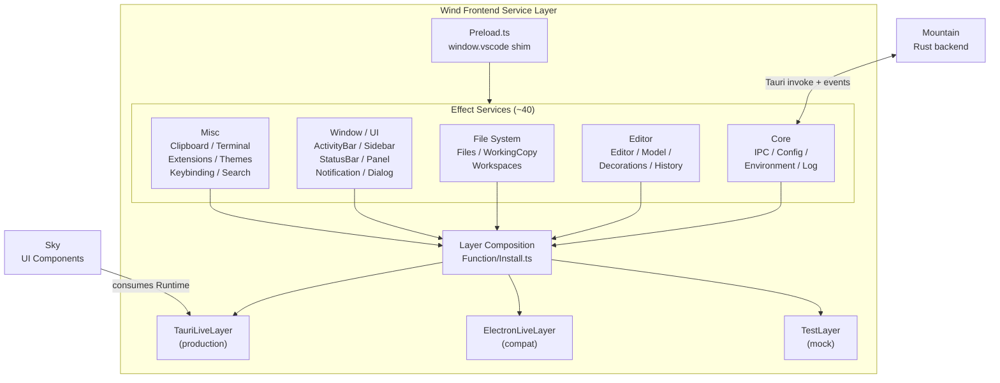

<table>
	<tr>
		<td colspan="1">
			<h3 align="center">
				<picture>
					<source media="(prefers-color-scheme: dark)" srcset="https://editor.land/Dark/Image/GitHub/Land.svg">
					<source media="(prefers-color-scheme: light)" srcset="https://editor.land/Image/GitHub/Land.svg">
					
				</picture>
			</h3>
		</td>
		<td colspan="3" valign="top">
			<h3 align="center"> Wind 🍃</h3>
		</td>
	</tr>
</table>

---

# **Wind** 🍃 Architecture

`Wind` is the `Effect-TS` service layer for the VS Code workbench.

- `Wind` enables the workbench to function inside a `Tauri` WebView.
- It recreates the essential VS Code renderer environment.
- It implements core services through `Effect-TS` typed error and dependency
  injection patterns.
- It connects the frontend to `Mountain`'s Rust backend through `Tauri`'s
  `invoke()` and event system.

---

## Table of Contents

1. [Overview](#overview)
2. [Architecture](#architecture)
3. [Service Architecture](#service-architecture)
4. [Layer Composition](#layer-composition)
5. [Preload Shim Integration](#preload-shim-integration)
6. [Service Catalog](#service-catalog)
7. [Mountain IPC Service](#mountain-ipc-service)
8. [Workbench Integration](#workbench-integration)
9. [Related Documentation](#related-documentation)

---



## Overview 📋

`Wind` provides the `Effect-TS` native service layer that `Sky` consumes.

- It replaces VS Code's `Electron` IPC pipeline with typed `Tauri` commands.
- These commands are routed to Rust handlers in `Mountain`.
- This eliminates the untyped serialization layer.
- It preserves full VS Code workbench compatibility.

| Attribute    | Value                                                                     |
| ------------ | ------------------------------------------------------------------------- |
| Language     | `TypeScript` (`Effect-TS` v3.21)                                          |
| Framework    | `Vite`                                                                    |
| IPC          | `Tauri` `invoke()` + events                                               |
| Dependencies | `@codeeditorland/output`, `@tauri-apps/api`, `effect`, `@effect/platform` |
| Consumed by  | `Sky`                                                                     |

---

## Architecture 🏗️

```
+------------------------------------------------------------------+
|                         Wind                                      |
|                                                                   |
|  +------------------+  +------------------+  +------------------+ |
|  | Preload.ts       |  | Effect/          |  | Function/        | |
|  | window.vscode    |  | ~40 service      |  | Install.ts       | |
|  | shim             |  | modules          |  | Layer composition| |
|  +------------------+  +------------------+  +------------------+ |
|                                                                   |
|  +------------------+  +------------------+  +------------------+ |
|  | Workbench/       |  | Telemetry/       |  | IPC/             | |
|  | VS Code workbench|  | PostHog bridge   |  | Tauri event      | |
|  | integration      |  | OTLP bridge      |  | channels         | |
|  +------------------+  +------------------+  +------------------+ |
|                                                                   |
|  +------------------+  +------------------+                       |
|  | Utility/         |  | Types/           |                       |
|  | Tier.ts          |  | Error types,     |                       |
|  | Configuration    |  | interfaces       |                       |
|  +------------------+  +------------------+                       |
+------------------------------------------------------------------+
```

### Module Map 🗺️

| Path                                | Purpose                                                           |
| ----------------------------------- | ----------------------------------------------------------------- |
| `Source/Preload.ts`                 | `Electron`/`Node.js` API shim (see Polyfills)                     |
| `Source/Effect/`                    | Service implementations (each domain as Define/Implement/Problem) |
| `Source/Function/Install.ts`        | Layer composition and installation entry point                    |
| `Source/Function/Install/`          | Layer composition details                                         |
| `Source/Workbench/`                 | VS Code workbench integration                                     |
| `Source/Telemetry/PostHogBridge.ts` | In-webview PostHog client                                         |
| `Source/IPC/Channel.ts`             | `Tauri` event channel definitions                                 |
| `Source/Utility/Tier.ts`            | Tier configuration reader                                         |
| `Source/Types/`                     | `TypeScript` type definitions                                     |
| `Source/Bootstrap/`                 | Bootstrap type definitions                                        |

---

## Service Architecture 🏗️

Each `Wind` service follows a consistent module structure using the
Define/Implement/Problem pattern:

```
Effect/<Service>/
    +-- Define.ts       - The service Tag (Effect-TS service identifier)
    +-- Implement.ts    - The service implementation (for TauriLiveLayer)
    +-- Problem.ts      - Typed error effects
```

This pattern provides:

- **Define.ts**: Exports the `Effect-TS` `Tag` that identifies the service.
  Functions that depend on the service use `Tag` for compile-time dependency
  tracking.
- **Implement.ts**: Exports the concrete `Layer` with the `Tauri`-backed
  implementation. Uses `@tauri-apps/api/invoke` for `Mountain` communication.
- **Problem.ts**: Exports typed error types as `Effect-TS` `Cause` subtypes,
  enabling structured error handling.

### Example Service Structure

```typescript
// Effect/Clipboard/Define.ts
export class Clipboard extends Context.Tag("Clipboard")<
	Clipboard,
	{ readonly readText: Effect<string, ClipboardProblem> }
>() {}

// Effect/Clipboard/Implement.ts
export const ClipboardLive = Layer.succeed(
	Clipboard,
	Clipboard.of({
		readText: Effect.tryPromise({
			try: () => invoke("get_clipboard", { format: "text" }),
			catch: (e) => new ClipboardProblem({ message: String(e) }),
		}),
	}),
);

// Effect/Clipboard/Problem.ts
export class ClipboardProblem extends Data.TaggedError("ClipboardProblem")<{
	message: string;
}> {}
```

---

## Layer Composition 🧩

`Wind` services compose into three `Layer` stacks:

```typescript
// TauriLiveLayer: All production services for Tauri WebView
export const TauriLiveLayer: Layer<Clipboard | Configuration | Editor | ... > =
    Layer.mergeAll(
        ClipboardLayer,
        ConfigurationLayer,
        EditorLayer,
        TerminalLayer,
        DialogLayer,
        FileServiceLayer,
        WindowLayer,
        // ... all ~40 services
    );

// ElectronLiveLayer: Electron-compatible implementations
export const ElectronLiveLayer: Layer<...> = Layer.mergeAll(
    ElectronClipboardLayer,
    ElectronConfigurationLayer,
    // ... Electron-specific implementations
);

// TestLayer: Mock implementations for extension test runner
export const TestLayer: Layer<...> = Layer.mergeAll(
    MockClipboardLayer,
    MockConfigurationLayer,
    // ... mock implementations
);
```

### Layer Resolution

```
Sky entry point (index.astro)
    |
    v
Install.installLayer()
    |
    +---> Reads Tier configuration from import.meta.env
    +---> Selects active Layer stack:
    |       - TierWorkbench === "Electron" -> ElectronLiveLayer
    |       - TierWorkbench === "Mountain" -> TauriLiveLayer (default)
    |       - Test mode -> TestLayer
    |
    +---> Layer.toRuntime() converts to Effect-TS Runtime
    +---> Provides Runtime to Sky UI components
    |
    v
Wind services available to Sky via Effect.flatMap
```

---

## Preload Shim Integration 🔌

`Wind`'s `Preload.ts` (see `Polyfills.md` for full details) runs before the
workbench bundle loads:

```
1. Preload.ts executes (inline, synchronous)
    |
    +---> window.vscode = { ipcRenderer, process }
    +---> window.MonacoEnvironment configured
    +---> window.__CEL_LAND__.polyfills populated
    +---> dispatchEvent("land-preload-ready")
    |
    v
2. Workbench bundle loads from @codeeditorland/output
    |
    v
3. Wind AppLayer created
    +---> composeLayer() creates TauriLiveLayer
    +---> Layer.toRuntime() converts to active Runtime
    |
    v
4. Workbench class instantiated: new Workbench(...)
    - Uses window.vscode for IPC
    - Uses Wind services for state and data
```

---

## Service Catalog 📋

### Core Infrastructure

| Service       | Module                    | Purpose                                           |
| ------------- | ------------------------- | ------------------------------------------------- |
| IPC           | `Effect/IPC.ts`           | `Tauri` command invocation and event subscription |
| Configuration | `Effect/Configuration.ts` | Read/write settings via `Mountain`                |
| Environment   | `Effect/Environment.ts`   | OS environment variables and paths                |
| Mountain      | `Effect/Mountain.ts`      | `gRPC`-level communication with `Mountain`        |
| MountainSync  | `Effect/MountainSync.ts`  | Synchronous state snapshot from `Mountain`        |
| Log           | `Effect/Logging`          | Structured logging                                |

### Editor Services

| Service           | Module                        | Purpose                                |
| ----------------- | ----------------------------- | -------------------------------------- |
| Editor            | `Effect/Editor.ts`            | Text editor creation, focus, layout    |
| Model             | `Effect/Model.ts`             | Document model creation and management |
| TextModelResolver | `Effect/TextModelResolver.ts` | URI-to-model resolution                |
| CodeEditor        | `Effect/WorkbenchEditor/`     | Monaco editor widget                   |
| Decorations       | `Effect/Decorations.ts`       | Editor decoration management           |
| History           | `Effect/History.ts`           | Undo/redo stack management             |

### File System Services

| Service     | Module                  | Purpose                             |
| ----------- | ----------------------- | ----------------------------------- |
| Files       | `Effect/Files.ts`       | File read/write via `Mountain`      |
| WorkingCopy | `Effect/WorkingCopy.ts` | Dirty state and conflict management |
| Workspaces  | `Effect/Workspaces.ts`  | Workspace root resolution           |

### Window and UI Services

| Service      | Module                    | Purpose                                |
| ------------ | ------------------------- | -------------------------------------- |
| ActivityBar  | `Effect/ActivityBar.ts`   | Activity bar state                     |
| Sidebar      | `Effect/Sidebar.ts`       | Side bar visibility and view switching |
| StatusBar    | `Effect/StatusBar.ts`     | Status bar items                       |
| Panel        | `Effect/Panel.ts`         | Bottom panel (terminal, output)        |
| Notification | `Effect/Notification.ts`  | Toast notifications                    |
| Progress     | `Effect/Progress.ts`      | Long-running operation progress        |
| Dialog       | `Effect/WorkbenchDialog/` | Message boxes and input boxes          |
| QuickInput   | `Effect/QuickInput.ts`    | Quick pick and input box               |

### Clipboard, Terminal, and Extensions

| Service    | Module                 | Purpose                             |
| ---------- | ---------------------- | ----------------------------------- |
| Clipboard  | `Effect/Clipboard.ts`  | System clipboard via `Mountain`     |
| Terminal   | `Effect/Terminal.ts`   | Integrated terminal management      |
| Extensions | `Effect/Extensions.ts` | Extension install/uninstall/list    |
| Language   | `Effect/Language.ts`   | Language mode detection             |
| Themes     | `Effect/Themes.ts`     | Color theme management              |
| Keybinding | `Effect/Keybinding.ts` | Keyboard shortcut resolution        |
| Search     | `Effect/Search.ts`     | File and text search via `Mountain` |
| Telemetry  | `Effect/Telemetry.ts`  | Event telemetry                     |
| Storage    | `Effect/Storage.ts`    | Key-value storage                   |
| Lifecycle  | `Effect/Lifecycle.ts`  | Application lifecycle events        |
| Health     | `Effect/Health.ts`     | Service health monitoring           |

---

## Mountain IPC Service 🔌

The `Mountain` service (`Effect/Mountain.ts`) maintains a runtime connection to
the Rust backend:

```typescript
// Wind sends commands to Mountain via Tauri invoke
const fileContent: Uint8Array = await invoke("read_file", {
	path: workspaceFile.fsPath,
});

// Wind listens for Mountain events
await listen("configuration-changed", (event) => {
	syncConfiguration(event.payload);
});
```

### Command Mapping

| Wind Service      | Tauri Command       | Mountain Handler      |
| ----------------- | ------------------- | --------------------- |
| Files.read        | `read_file`         | FileSystemProvider    |
| Files.write       | `write_file`        | FileSystemProvider    |
| Configuration.get | `get_configuration` | ConfigurationProvider |
| Configuration.set | `set_configuration` | ConfigurationProvider |
| Terminal.create   | `create_terminal`   | TerminalProvider      |
| Terminal.write    | `write_terminal`    | TerminalProvider      |
| Dialog.open       | `open_dialog`       | UserInterfaceProvider |
| Clipboard.read    | `get_clipboard`     | Clipboard             |
| Clipboard.write   | `set_clipboard`     | Clipboard             |

---

## Workbench Integration 🔌

`Wind` integrates with the VS Code workbench by providing service
implementations that satisfy the workbench's dependency injection container:

```typescript
// VS Code workbench expects IFileService
// Wind provides FileService that implements the same interface
const workbench = new Workbench({
	fileService: Wind.FileService,
	configurationService: Wind.Configuration,
	editorService: Wind.Editor,
	notificationService: Wind.Notification,
	// ... all services the workbench expects
});

await workbench.startup();
```

---

## Related Documentation 📚

- [Sky](https://github.com/CodeEditorLand/Sky/tree/Current/Documentation/GitHub/Architecture.md) -
  UI component layer (`Wind` consumer)
- [Cocoon](https://github.com/CodeEditorLand/Cocoon/tree/Current/Documentation/GitHub/Architecture.md) -
  Extension host (parallel API surface)
- [Mountain](https://github.com/CodeEditorLand/Mountain/tree/Current/Documentation/GitHub/Architecture.md) -
  Backend (IPC target)
- [Output](https://github.com/CodeEditorLand/Output/tree/Current/Documentation/GitHub/Architecture.md) -
  Compiled workbench consumer
- [Polyfills](https://github.com/CodeEditorLand/Land/tree/Current/Documentation/GitHub/Polyfills.md) -
  `Preload.ts` shim details
- [EditorCore](https://github.com/CodeEditorLand/Land/tree/Current/Documentation/GitHub/EditorCore.md) -
  Editor workbench adaptation

---

**Project Maintainers:** Source Open
([Source/Open@Editor.Land](mailto:Source/Open@Editor.Land)) |
[GitHub Repository](https://github.com/CodeEditorLand/Wind) |
[Report an Issue](https://github.com/CodeEditorLand/Wind/issues)
