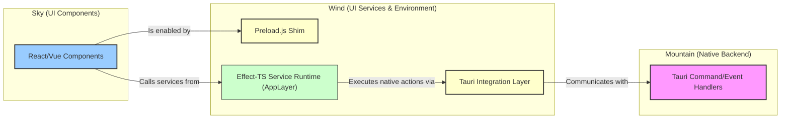

<table><tr>
<td colspan="1"> <h3 align="center"> <picture>
<source media="(prefers-color-scheme: dark)" srcset="https://PlayForm.Cloud/Dark/Image/GitHub/Land.svg">
<source media="(prefers-color-scheme: light)" srcset="https://PlayForm.Cloud/Image/GitHub/Land.svg">

</picture> </h3> </td> <td colspan="3" valign="top"> <h3 align="center"> Wind 🍃
</h3> </td>
</tr></table>

---

# **Wind** 🍃 Deep Dive & Architecture

This document provides a detailed technical overview of the **Wind** project for
developers. It explores the internal architecture, core components, and the
design patterns used to create a robust, Effect-TS native service layer for the
Land Code Editor.

---

## Core Architecture Principles

| Principle            | Description                                                                                                                               | Key Components Involved                           |
| :------------------- | :---------------------------------------------------------------------------------------------------------------------------------------- | :------------------------------------------------ |
| **Compatibility**    | Provide a high-fidelity VSCode renderer environment to maximize `Sky`'s reusability and minimize changes needed for VSCode UI components. | `Preload.ts`, `Platform/VSCode/*`                 |
| **Modularity**       | Components (preload, services, integrations) are organized into distinct, cohesive modules for clarity and maintainability.               | `Application/*`, `Integration/*`, `Platform/*`    |
| **Robustness**       | Leverage `Effect-TS` for all service implementations and asynchronous operations, ensuring predictable error handling and composability.  | All `Effect`-based modules                        |
| **Abstraction**      | Create a clean `Integration` layer over Tauri APIs, isolating platform specifics and simplifying their usage within the application.      | `Integration/Tauri/Wrap/*`, `Preload.ts`          |
| **Integration**      | Seamlessly connect `Sky`'s frontend requests with `Mountain`'s backend capabilities through Tauri's `invoke`/event system.                | `Preload.ts` (ipcRenderer shim), `HostServiceTag` |
| **Build Efficiency** | Utilize `ESBuild` for fast and configurable bundling of necessary JavaScript assets.                                                      | `Source/Configuration/ESBuild/*`                  |

---

## Deep Dive into `Wind`'s Components

### 1. `Preload.ts` (The Environmental Foundation)

- **Role:** This cornerstone script is executed in the Tauri webview _before_
  `Sky`'s main application code loads. Its primary purpose is to establish a
  VSCode-like renderer environment, making `Sky` feel at home.
- **Functionality:**
    - **`window.vscode` Global:** Creates and populates the global object that
      is the critical entry point for workbench services.
    - **API Shimming:**
        - `ipcRenderer`: Implements the `IpcRenderer` interface (`send`,
          `invoke`, `on`) by mapping calls to Tauri's event system (`TauriEmit`,
          `TauriListen`) and `TauriInvoke` mechanism.
        - `process`: Provides an `ISandboxNodeProcess`-like object with
          properties such as `platform`, `arch`, `env`, and `cwd()`, fetching
          real data from the `Mountain` backend via Tauri `invoke` calls.
    - **Configuration Resolution:** Implements `context.resolveConfiguration()`
      which dynamically reads the `ISandboxConfiguration` from a meta tag
      injected into the `index.html` by `Mountain`. It includes logic to revive
      URI-like objects into true `URI` instances.

### 2. `Source/Integration/Tauri/*` (The Anti-Corruption Layer)

- **Role:** This crucial layer provides the direct interface to all Tauri APIs
  and manages type conversions, all robustly wrapped within `Effect`s. It is the
  **only** part of the `Wind` application allowed to directly call
  `@tauri-apps/api`, creating a clean boundary between pure application logic
  and impure external calls.
- **Component Breakdown:**
    - **`Wrap/*`:** Contains Effect wrappers for all Tauri APIs. For example,
      `Integration/Tauri/Clipboard/Wrap/ReadText.ts` wraps the `readText`
      function from `@tauri-apps/api/clipboard` in an `Effect` that yields a
      `string` on success and a `ClipboardProblem` on failure.
    - **`Convert/*`:** Contains pure functions for data conversion. For example,
      `Integration/Tauri/Convert/FiltersToTauri.ts` converts a VSCode
      `FileFilter[]` into the format required by Tauri's dialog API.
    - **`Resolve/*`:** Contains composed Effects for complex, multi-step
      operations. For instance, `Resolve/FinalDefaultPath.ts` is an Effect that
      determines the best default path for a file dialog by trying the user's
      provided URI first, then falling back to their home or documents
      directory.
    - **`Error/*`:** Defines a suite of specific, tagged error classes (e.g.,
      `DialogProblem`, `PathProblem`, `WindowProblem`) that allow for precise
      error handling using `Effect.catchTag`.

### 3. `Source/Effect/Produce/*` (Effect Factories)

- **Role:** A small, powerful internal library of "meta-factories" for creating
  `Effect`s from existing promise-based functions in a standardized way. This is
  the engine that makes the `Integration` layer so clean and consistent.
- **Functionality:**
    - `FromAsync.ts`: A higher-order function that takes an async function
      (e.g., `dialog.open`) and an error constructor, and returns a new function
      that produces a fully-typed `Effect`.
    - `OptionalFromAsync.ts`: A variant for async functions that can return
      `null` or `undefined`, correctly wrapping the result in an `Option<T>`.

### 4. `Source/Application/*` (Core Frontend Services)

- **Role:** This directory houses the high-fidelity, Effect-TS native
  implementations of VSCode's core frontend services (e.g.,
  `IFileDialogService`, `IClipboardService`).
- **Structure of a Service (e.g., `Application/Dialog/`):**
    - **`Tag.ts`:** Defines the `Context.Tag` for the service (e.g.,
      `DialogServiceTag`), which is used for dependency injection.
    - **`Error.ts`:** Defines the application-level, domain-specific error for
      the service (e.g., `ApplicationDialogProblem`), which typically wraps a
      lower-level `Integration` error.
    - **`Orchestrate/*.ts`:** Contains complex, multi-step Effects that define
      the core business logic of the service. For example,
      `Orchestrate/PickAndOpen.ts` is an Effect that composes the steps of
      showing a dialog, getting a result, and then requesting the host to open a
      new window with that result.
    - **`Definition.ts`:** Contains the concrete implementation of the VSCode
      service interface. It is a thin layer that maps the interface's
      promise-based methods to the execution of the declarative Effects defined
      in `Orchestrate/`.
    - **`Live.ts`:** Defines the `Layer` that provides the live implementation
      of the service, wiring together the `Definition` with its dependencies.

### End-to-End Workflow Example: `showOpenDialog`

This demonstrates how all the layers work together:

1.  **UI Call (`Sky`):** The UI code calls `dialogService.showOpenDialog(...)`.
2.  **Application Layer (`Application/Dialog/Definition.ts`):** The
    `showOpenDialog` method runs the `Orchestrate.PerformShowOpen` Effect.
3.  **Orchestration Effect (`Application/Dialog/Orchestrate/ShowOpen.ts`):**
    `PerformShowOpen` composes several steps: a. It resolves the default path
    for the dialog using an Effect from `Integration/Tauri/Resolve/`. b. It
    converts the VSCode dialog options into Tauri-compatible options using a
    function from `Integration/Tauri/Convert/`. c. It calls the
    `RequestOpenDialog` Effect from `Integration/Tauri/Wrap/`.
4.  **Integration Layer (`Integration/Tauri/Wrap/RequestOpenDialog.ts`):** The
    `RequestOpenDialog` Effect executes its logic, which is a call to
    `@tauri-apps/api/dialog.open()`.
5.  **Tauri Backend (`Mountain`):** Tauri receives the API call, displays the
    native OS file-picker dialog, and returns the result (the selected path or
    `null`) to the webview.
6.  **Unwinding the Effect:** The result flows back up the chain. The
    `Integration` Effect catches any errors and wraps them in a `DialogProblem`.
    The `Application` Effect receives the result, converts the path string back
    into a `URI` object, and finally resolves the promise that was returned to
    the original UI caller.

---

## Project Structure Overview

The `Wind` repository is organized to clearly separate concerns:

```
Wind/
└── Source/
    ├── Preload.ts                   # Core script for VSCode environment emulation in Tauri.
    ├── Application/                 # Core frontend service implementations.
    ├── Integration/
    │   └── Tauri/                   # Bridge to Tauri APIs, wrapped in Effect-TS.
    ├── Platform/
    │   └── VSCode/                  # Definitions of core VSCode types and service Tags.
    ├── Effect/
    │   └── Produce/                 # Utilities for creating Effects from async code.
    └── Configuration/
        └── ESBuild/                 # ESBuild configurations for bundling the project.
```

---

## How `Wind` Fits into the `Land` Ecosystem

`Wind` is the indispensable service layer that powers the `Sky` UI and
communicates with the `Mountain` backend.


