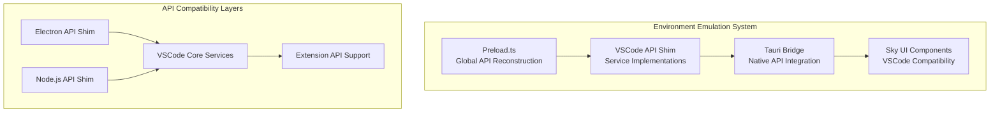
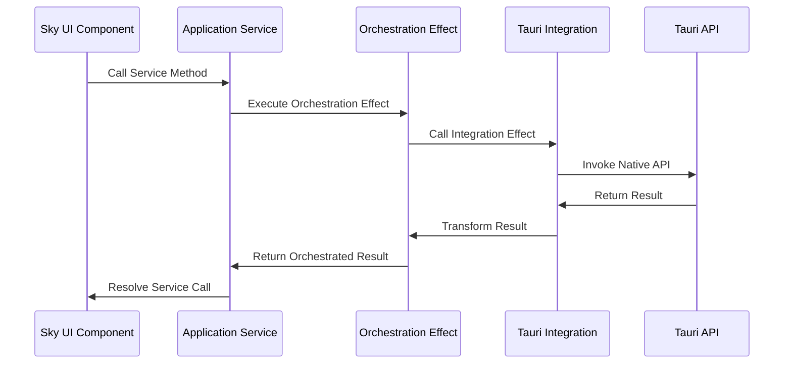
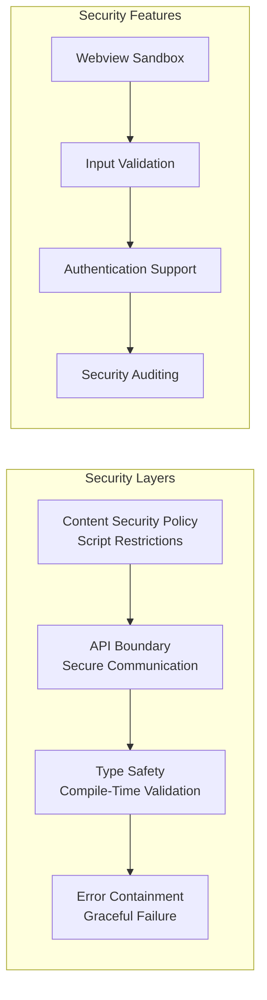
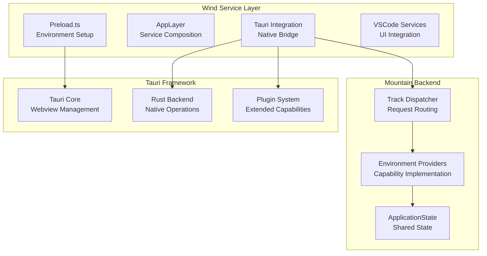
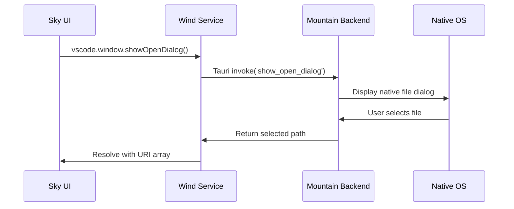
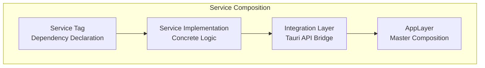
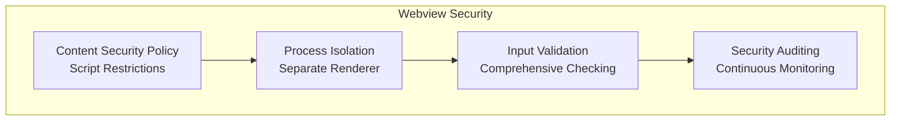
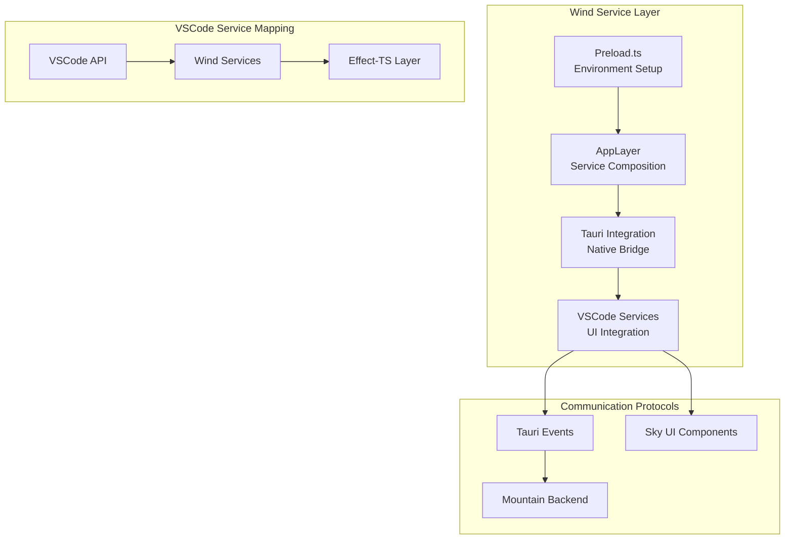
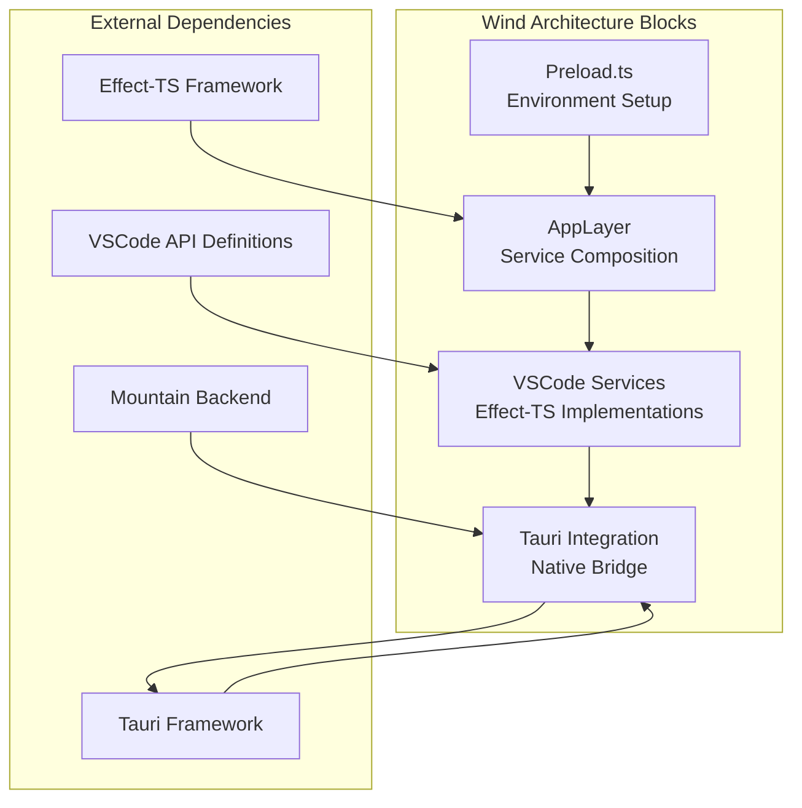
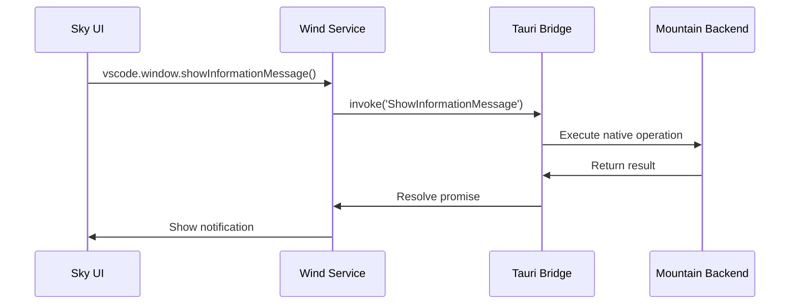

<table>
	<tr>
		<td colspan="1">
			<h3 align="center">
				<picture>
					<source media="(prefers-color-scheme: dark)" srcset="https://editor.land/Dark/Image/GitHub/Land.svg">
					<source media="(prefers-color-scheme: light)" srcset="https://editor.land/Image/GitHub/Land.svg">
					
				</picture>
			</h3>
		</td>
		<td colspan="3" valign="top">
			<h3 align="center"> Wind 🍃</h3>
		</td>
	</tr>
</table>

---

# **Wind** 🍃 Deep Dive & Architecture

**Wind** provides the technical foundation for implementing VSCode UI
services using Effect-TS within the Land project. **Wind** serves as the
frontend service layer that provides VSCode API compatibility through Effect-TS
native implementations and Tauri integration.

---

## Core Architecture Principles

| Principle                           | Description                                                                                                                               | Key Components Involved                  |
| :---------------------------------- | :---------------------------------------------------------------------------------------------------------------------------------------- | :--------------------------------------- |
| **High-Fidelity Emulation**         | Provide comprehensive VSCode renderer environment emulation to maximize `Sky`'s reusability with minimal changes to VSCode UI components. | `Preload.ts`, `Platform/VSCode/*`        |
| **Effect-TS Native Architecture**   | Build the entire application with Effect-TS, using `Layer` composition and declarative effects for maximum robustness and type safety.    | All `Effect`-based modules               |
| **Anti-Corruption Layer**           | Create a clean abstraction layer over Tauri APIs, isolating platform specifics and simplifying usage within the application.              | `Integration/Tauri/Wrap/*`, `Preload.ts` |
| **Declarative Service Composition** | Implement VSCode frontend services using Effect-TS patterns for clean dependency injection and composable service construction.           | `Application/*`, `AppLayer`              |
| **Performance Optimization**        | Utilize efficient bundling strategies and optimized API shimming to minimize overhead while maintaining compatibility.                    | `Configuration/ESBuild/*`, `Preload.ts`  |
| **Security Hardening**              | Implement comprehensive security measures for Tauri webview environment, including CSP and secure API boundaries.                         | `Preload.ts` security patterns           |

---

## Deep Dive into `Wind`'s Components

### 1. `Preload.ts` (The Environmental Foundation)

- **Role:** This cornerstone script is executed in the Tauri webview _before_
  `Sky`'s main application code loads, establishing a VSCode-like renderer
  environment.
- **Advanced Implementation:**
    - **Global API Reconstruction:** Creates and populates the `window.vscode`
      global object that serves as the critical entry point for workbench
      services.
    - **Sophisticated API Shimming:**
        - `ipcRenderer`: Implements the complete `IpcRenderer` interface by
          mapping calls to Tauri's event system (`TauriEmit`, `TauriListen`) and
          `TauriInvoke` mechanism.
        - `process`: Provides an `ISandboxNodeProcess`-like object with
          comprehensive properties including `platform`, `arch`, `env`, and
          `cwd()`.
    - **Configuration Resolution:** Implements `context.resolveConfiguration()`
      which dynamically reads `ISandboxConfiguration` from meta tags injected by
      `Mountain`.
    - **Security Hardening:** Implements Content Security Policy (CSP)
      compliance and secure API boundary enforcement.

### 2. `Integration/Tauri/*` (The Anti-Corruption Layer)

- **Role:** Provides the direct interface to Tauri APIs with comprehensive type
  conversions, all robustly wrapped within `Effect`s.
- **Concrete Architecture:**
    - **Effect Factories (`Wrap/*`):** Contains concrete Effect wrappers for all
      Tauri APIs, converting promise-based APIs to Effect-based operations.
    - **Type Converters (`Convert/*`):** Provides pure functions for converting
      between VSCode types and Tauri-compatible formats.
    - **Complex Resolvers (`Resolve/*`):** Implements multi-step operations with
      comprehensive error handling and fallback logic.
    - **Domain-Specific Errors (`Error/*`):** Defines precise error classes
      enabling sophisticated error handling with `Effect.catchTag`.

### 3. `Effect/Produce/*` (Effect Meta-Factories)

- **Role:** Provides powerful "meta-factories" for creating `Effect`s from
  existing promise-based functions in a standardized, type-safe manner.
- **Concrete Patterns:**
    - `FromAsync`: Higher-order function that transforms async functions into
      Effect-producing functions with proper error typing.
    - `OptionalFromAsync`: Variant for functions that return `null` or
      `undefined`, correctly wrapping results in `Option<T>`.
    - **Generic Type Inference:** Concrete type inference patterns that preserve
      function signatures while adding Effect semantics.

### 4. `Application/*` (Core Frontend Services)

- **Role:** Houses high-fidelity, Effect-TS native implementations of VSCode's
  core frontend services.
- **Concrete Service Architecture:**
    - **Tag-Based Dependency Injection:** Uses `Context.Tag` patterns for clean
      service dependency management.
    - **Orchestration Patterns:** Complex multi-step Effects that define the
      core business logic of each service.
    - **Layer Composition:** Concrete layer composition patterns that build
      complete service implementations from individual components.
    - **Error Transformation:** Comprehensive error transformation from
      integration-level errors to application-level error types.

---

## Concrete Technical Architecture

### Core Architectural Components

#### 1. VSCode Environment Emulation Architecture

Wind's concrete environment emulation enables seamless VSCode compatibility:



**Concrete API Compatibility Guarantees**

Wind's environment emulation provides high-fidelity VSCode API compatibility
through:

1. **Interface Matching:** All VSCode API interfaces are precisely matched in
   TypeScript definitions
2. **Behavior Preservation:** API behavior is preserved through sophisticated
   shimming and event mapping
3. **Error Handling Compatibility:** Error types and handling patterns match
   VSCode expectations
4. **Asynchronous Semantics:** Async operations maintain proper sequencing and
   error propagation

#### 2. Effect-TS Service Layer Architecture

Wind implements concrete Effect-TS patterns for robust service composition:



#### 3. Security Architecture

Wind implements comprehensive security measures for the Tauri webview
environment:



### Concrete Technical Characteristics

#### Performance Analysis: API Call Latency

**Latency Breakdown:**

- **VSCode API Shim:** ~0.02ms (interface matching overhead)
- **Effect Orchestration:** ~0.05ms (Effect composition overhead)
- **Tauri Integration:** ~0.03ms (API boundary crossing)
- **Native Execution:** Variable (OS-dependent native operation)
- **Total Latency:** ~0.10ms + native execution time

**Benefits:**

- **Type Safety:** Full TypeScript type checking throughout the call stack
- **Error Handling:** Comprehensive error handling with proper typing
- **Testability:** Mockable Effects for comprehensive unit testing
- **Maintainability:** Clear separation of concerns between layers

#### Security Implementation Characteristics

Wind's security architecture prevents common webview security vulnerabilities
through:

1. **CSP Enforcement:** Strict Content Security Policy prevents script injection
2. **API Boundary Security:** Secure communication channel between webview and
   native code
3. **Input Validation:** Comprehensive input validation at all API boundaries
4. **Error Containment:** Errors are properly contained and logged without
   information leakage

### Ecosystem Integration Mapping



### Advanced Integration Patterns

#### Real-time UI Operation Flow



#### Service Layer Composition Pattern



---

## Advanced Usage Patterns

### TierIPC Routing

`TauriMainProcessService.ts` supports three IPC routing modes controlled by the
`TierIPC` environment variable:

| Value          | Behavior                                                                                        |
| :------------- | :---------------------------------------------------------------------------------------------- |
| `Mountain`     | All `channel.call()` invocations go directly to Mountain via `@tauri-apps/api` invoke (default) |
| `NodeDeferred` | Mountain first; if the result is `undefined` or `null`, falls back to `cocoon:request` bridge   |
| `Node`         | All calls route to Cocoon via the `cocoon:request` bridge (pure Node.js path)                   |

Per-subsystem defaults that override `TierIPC`:

| Variable    | Default  | Routed to             |
| :---------- | :------- | :-------------------- |
| `TierIPC`   | Mountain | Main IPC default      |
| `TierTasks` | Node     | Tasks route to Cocoon |
| `TierAuth`  | Node     | Auth routes to Cocoon |

All tier variables are mirrored into `import.meta.env.Tier*` at build time by
`astro.config.ts` so Sky's `Utility/Tier.ts` resolves the same values without a
runtime lookup.

---

### ManagedRuntime

`Source/Effect/LandWorkbench/LandWorkbenchRuntime.ts` provides the
module-singleton `ManagedRuntime` for the Wind service layer:

- **Eagerly initialized** via IIFE at module load time - Layer initialization
  cost is paid once during Sky bundle evaluation, not on the first service
  `Get()` call.
- **Singleton via `globalThis.__CEL_WIND_RUNTIME__`** - two sibling Sky chunks
  that import the module land on the same instance.
- **Sub-5 ms service lookup** - the runtime is already warm by the time VS Code
  workbench calls any service method.

Services are composed with `Layer.succeed` (not `Layer.effect`) for services
that do not need async initialization. This keeps the Layer graph synchronous
and avoids unnecessary Effect scheduling overhead during startup.

---

### Custom Service Implementation

Wind enables sophisticated custom service implementations:

```typescript
// Advanced service implementation pattern
import { Context, Effect, Layer } from "effect";

import { DialogServiceTag } from "./Application/Dialog/Tag";

// Custom service implementation
class CustomDialogService {
	async showCustomDialog(
		options: CustomDialogOptions,
	): Promise<URI[] | undefined> {
		return Effect.runPromise(
			Effect.flatMap(DialogServiceTag, (dialogService) =>
				Effect.tryPromise(() =>
					dialogService.showCustomDialog(options),
				),
			),
		);
	}
}

// Service layer composition - use Layer.succeed for sync init
const CustomDialogLayer = Layer.succeed(
	DialogServiceTag,
	new CustomDialogService(),
);
```

### Performance Monitoring Integration

Wind supports comprehensive performance monitoring:

```typescript
// Performance monitoring integration
import { Effect, Metric } from "effect";

const apiCallTimer = Metric.timer("wind_api_call_duration");

async function monitoredApiCall() {
	return Effect.runPromise(
		apiCallTimer(
			Effect.flatMap(DialogServiceTag, (service) =>
				Effect.tryPromise(() => service.showOpenDialog(options)),
			),
		),
	);
}
```

### Advanced Error Handling Patterns

Sophisticated error handling with Effect-TS:

```typescript
// Comprehensive error handling pattern
import { Effect, Either } from "effect";

import { DialogProblem } from "./Application/Dialog/Error";

async function robustDialogOperation() {
	const result = await Effect.runPromise(
		Effect.either(
			Effect.flatMap(DialogServiceTag, (service) =>
				Effect.tryPromise({
					try: () => service.showOpenDialog(options),
					catch: (error) => new DialogProblem({ cause: error }),
				}),
			),
		),
	);

	return Either.match(result, {
		onLeft: (error) => handleError(error),
		onRight: (uris) => handleSuccess(uris),
	});
}
```

## Performance Characteristics

### Bundle Optimization

- **Tree Shaking:** Advanced tree shaking eliminates unused code from final
  bundles
- **Code Splitting:** Strategic code splitting for optimal loading performance
- **Minification:** Comprehensive minification for minimal bundle size
- **Compression:** Gzip/Brotli compression support

### Runtime Performance

- **Fast API Resolution:** Efficient service resolution through Effect-TS layers
- **Minimal Overhead:** Optimized shimming with near-native performance
- **Memory Efficiency:** Efficient memory usage through smart caching
- **Startup Optimization:** Fast startup through optimized initialization

### Security Performance

- **Low Security Overhead:** Security measures designed for minimal performance
  impact
- **Efficient Validation:** Fast input validation with comprehensive coverage
- **Secure Communication:** Optimized secure communication channels
- **Audit Performance:** Efficient security auditing without performance
  degradation

## Advanced Security Considerations

### Webview Security

Wind implements comprehensive webview security measures:



### API Security Patterns

Sophisticated API security patterns:

```typescript
// Secure API pattern implementation
import { Effect } from "effect";

class SecureAPIService {
	async secureOperation(input: unknown): Promise<Result> {
		return Effect.runPromise(
			Effect.flatMap(ValidationServiceTag, (validator) =>
				Effect.flatMap(validator.validateInput(input), (validated) =>
					Effect.tryPromise(() =>
						this.executeSecureOperation(validated),
					),
				),
			),
		);
	}
}
```

## Development Guidelines

### Adding New Services

When adding new services to Wind, follow these patterns:

1. **Define Service Interface:** Create TypeScript interface matching VSCode
   service
2. **Implement Effect-TS Service:** Create Effect-TS based implementation
3. **Create Integration Layer:** Implement Tauri integration with proper error
   handling
4. **Define Service Tag:** Create Context.Tag for dependency injection
5. **Compose Service Layer:** Add service to main AppLayer composition

### Performance Optimization

- **Minimize Bundle Size:** Carefully manage dependencies and imports
- **Optimize Effect Composition:** Use efficient Effect composition patterns
- **Implement Caching:** Strategic caching for frequently used operations
- **Monitor Performance:** Continuous performance monitoring and optimization

### Security Best Practices

- **Validate All Inputs:** Comprehensive input validation at all boundaries
- **Implement Proper Error Handling:** Secure error handling without information
  leakage
- **Follow Tauri Security Guidelines:** Adhere to Tauri security recommendations
- **Regular Security Audits:** Continuous security auditing and improvement

Wind represents a sophisticated integration layer that enables VSCode-based UI
components to operate seamlessly within the Tauri framework, providing high
performance, robust security, and comprehensive compatibility through advanced
TypeScript and Effect-TS patterns.

---

## Concrete VSCode Service Lifting Architecture



#### Service Implementation Table

| VSCode Service      | Wind Service       | Effect-TS Layer  | Communication Protocol |
| :------------------ | :----------------- | :--------------- | :--------------------- |
| `vscode.window`     | `WindowService`    | `Effect.Service` | Tauri Events           |
| `vscode.commands`   | `CommandService`   | `Effect.Service` | Tauri Events           |
| `vscode.workspace`  | `WorkspaceService` | `Effect.Service` | Tauri Events           |
| `vscode.extensions` | `ExtensionService` | `Effect.Service` | Tauri Events           |
| `vscode.languages`  | `LanguageService`  | `Effect.Service` | Tauri Events           |

### Component Block Map



### Service Communication Patterns


