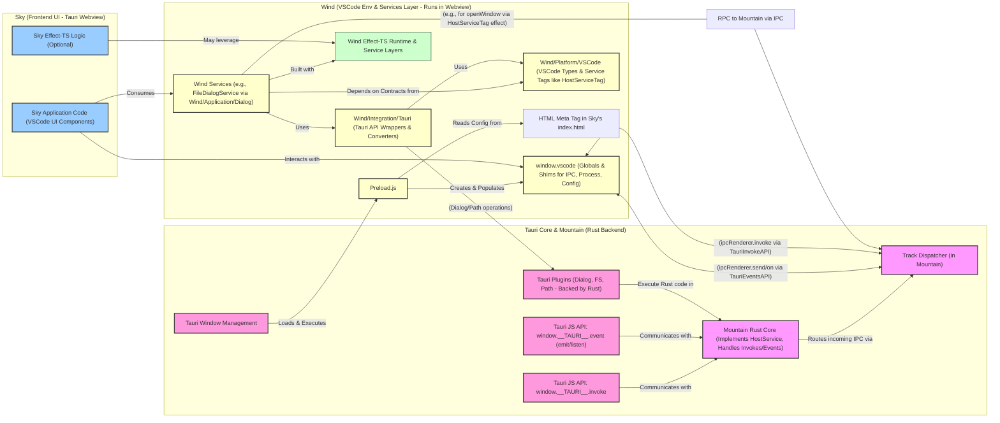

<table><tr>
<td colspan="1"> <h3 align="center"> <picture>
<source media="(prefers-color-scheme: dark)" srcset="https://PlayForm.Cloud/Dark/Image/GitHub/Land.svg">
<source media="(prefers-color-scheme: light)" srcset="https://PlayForm.Cloud/Image/GitHub/Land.svg">

</picture> </h3> </td> <td colspan="3" valign="top"> <h3 align="center"> Wind 🍃
</h3> </td>
</tr></table>

# **Wind** 🍃 The Breath of Land: VSCode Environment & Services for Tauri

[](https://github.com/CodeEditorLand/Wind/blob/Current/LICENSE)
[](https://www.npmjs.com/package/@codeeditorland/wind)
[](https://www.npmjs.com/package/@tauri-apps/api)
[](https://www.npmjs.com/package/@tauri-apps/plugin-dialog)
[](https://www.npmjs.com/package/effect)

Welcome to **Wind**! This element is the vital bridge that allows `Sky` (Land's
VSCode-based UI) to breathe and function natively within the **Tauri** shell.
**Wind** meticulously recreates essential parts of the VSCode renderer
environment, provides robust implementations of core services (like file
dialogs), and integrates seamlessly with **Tauri** APIs, ensuring a familiar and
functional experience. It replaces Electron-based implementations with Tauri's
OS-native equivalents, all underpinned by `effect-ts` for resilience and type
safety.

**Wind** is engineered to:

1.  **Emulate the VSCode Sandbox:** Through a sophisticated `Preload.ts` script,
    it shims critical Electron and Node.js APIs that VSCode's workbench code
    expects, creating a compatible execution context.
2.  **Implement Core VSCode Services:** It provides frontend implementations for
    key VSCode services (e.g., `IFileDialogService`), leveraging `effect-ts` for
    highly reliable, composable, and maintainable logic.
3.  **Integrate with Tauri & Native Capabilities:** It offers a clean
    abstraction layer over Tauri APIs for file operations, dialogs, OS
    information, and more, making them accessible in a VSCode-idiomatic way
    through `effect-ts` wrappers.
4.  **Uphold Robustness & Type Safety:** Extensive use of `effect-ts` and
    TypeScript ensures that services are resilient, integrations are sound, and
    errors are handled in a principled, predictable manner.

This element is not just about aesthetics; it's about the fundamental mechanics
that make `Sky` feel at home within `Land`'s native `Mountain` (Rust/Tauri
backend).

## Key Features

- **Native Dialog Experience:**
    - Implements VSCode's `IFileDialogService` for File Open/Save dialogs using
      Tauri's native OS dialogs.
    - Supports Folder/Workspace selection capabilities with appropriate VSCode
      options.
    - Ensures cross-platform consistency by abstracting OS-specific dialog
      behaviors.
- **VSCode Service & Environment Compliance:**
    - **`Preload.ts` Environment Emulation:**
        - Establishes the crucial `window.vscode` global object.
        - Provides shims for essential VSCode renderer APIs like `ipcRenderer`
          (bridged to Tauri events/invoke), `process` (platform, arch, versions,
          env, cwd), `webFrame` (zoom), `context` (configuration resolution),
          `webUtils`, and `ipcMessagePort`.
        - Dynamically constructs and injects `INativeWindowConfiguration` and
          `ISandboxConfiguration` by fetching data from HTML meta tags and
          direct Tauri API calls (for paths, OS details, window ID, etc.).
        - Handles URI revival and complex type marshalling for configuration
          data.
    - **Service Implementation (`Application/Dialog`):**
        - Offers a complete `IFileDialogService` compatible with VSCode's
          interface, including `_serviceBrand`.
        - Manages dialog workflows with `effect-ts` for clear, testable logic.
- **`effect-ts` Powered Architecture:**
    - **Functional Error Handling:** Employs `Effect` for all asynchronous
      operations and service logic, ensuring that all potential failures are
      explicitly handled as typed errors.
    - **Dependency Management:** Uses `Layer` and `Tag` from `effect-ts` for
      clean dependency injection and composable service construction.
    - **Type-Safe Conversions:** Provides robust mechanisms for converting
      between VSCode types (e.g., `URI`, `FileFilter`) and Tauri/native
      equivalents (e.g., path strings, Tauri dialog options).
- **Advanced Safety & Robustness:**
    - **`Option` Type Usage:** Systematically uses `Option<T>` for operations
      that may not yield a result (e.g., dialog cancellation), preventing
      null/undefined errors.
    - **Tagged Errors:** Defines a hierarchy of specific, tagged errors
      (`PathProblem`, `DialogProblem`, `WindowProblem`, `InheritanceProblem`)
      allowing for precise error identification and handling.
    - **Resource Management:** Leverages `effect-ts`'s scope management for any
      resources that might need explicit cleanup (though less common in this
      frontend-focused module).
- **Developer Tooling & Build System:**
    - **Mock Placeholders:** Includes `_HostServicePlaceholder.ts` for mocking
      backend dependencies (`HostServiceTag`), facilitating isolated development
      and testing of services like `Application/Dialog`.
    * **Conditional Logging:** `Preload.ts` includes `__DEV__` flag based
      logging for easier debugging.
    * **ESBuild Configuration:** Utilizes `ESBuild` via scripts (`Run.sh`,
      `prepublishOnly.sh`) and configuration files
      (`Source/Configuration/ESBuild/*`) for efficient bundling, minification,
      and transformation of TypeScript into browser-compatible JavaScript,
      particularly for `Preload.ts`.

## Core Architecture Principles

| Principle            | Description                                                                                                                                                                      | Key Components Involved                                                                  |
| :------------------- | :------------------------------------------------------------------------------------------------------------------------------------------------------------------------------- | :--------------------------------------------------------------------------------------- |
| **Compatibility**    | Strive to provide a high-fidelity VSCode renderer environment to maximize `Sky`'s reusability and minimize changes needed for VSCode UI components.                              | `Preload.ts`, `Platform/VSCode/*`                                                        |
| **Modularity**       | Components (preload, services, integrations, utilities) are organized into distinct, cohesive modules for clarity, maintainability, and independent reasoning.                   | `Application/*`, `Integration/*`, `Platform/*`, `Effect/*`                               |
| **Robustness**       | Leverage `effect-ts` for all service implementations and asynchronous operations, ensuring predictable error handling, context management, and composability.                    | All `Effect`-based modules (`Application/Dialog`, `Integration/Tauri`, `Effect/Produce`) |
| **Abstraction**      | Provide clear abstractions over Tauri APIs and VSCode platform details, simplifying their usage within `Sky` and other `Wind` services, and isolating platform specifics.        | `Integration/Tauri/Wrap/*`, `Platform/VSCode/*`, `Preload.ts` (shims)                    |
| **Integration**      | Designed to seamlessly connect `Sky`'s frontend requests with `Mountain`'s backend capabilities, primarily through Tauri's `invoke`/event system and platform service contracts. | `Preload.ts` (ipcRenderer shim), `HostServiceTag` interactions                           |
| **Build Efficiency** | Utilize `ESBuild` for fast and configurable bundling of necessary JavaScript assets, crucial for the `Preload.ts` script.                                                        | `Source/Configuration/ESBuild/*`, `Run.sh`, `prepublishOnly.sh`                          |

---

## Deep Dive into `Wind`'s Components

1.  **`Preload.ts` (The Environmental Foundation):**

    - **Role:** This cornerstone script is executed in the Tauri webview
      _before_ `Sky`'s main application code loads. Its primary purpose is to
      establish a VSCode-like renderer environment, making `Sky` feel at home.
    - **Functionality:**
        - **`window.vscode` Global:** Creates and populates the `window.vscode`
          global object, which is the critical entry point for many VSCode
          workbench services and utilities.
        - **API Shimming:**
            - `ipcRenderer`: Implements the `IpcRenderer` interface (`send`,
              `invoke`, `on`, `once`, `removeListener`) by mapping calls to
              Tauri's event system (`tauriEmit`, `tauriListen`, `tauriOnce`) and
              `invoke` mechanism. It filters IPC messages to expected `vscode:`
              channels.
            - `process`: Provides an `ISandboxNodeProcess`-like object with
              properties such as `platform`, `arch`, `type: 'renderer'`,
              `versions` (including Tauri and app versions), `env` (merged with
              `VSCODE_CWD`, `VSCODE_NLS_CONFIG`, etc.), `execPath`, `cwd()`,
              `getProcessMemoryInfo()` (mocked), and `shellEnv()` (mocked).
            - `webFrame`: Provides a `WebFrame` shim, currently with a
              `setZoomLevel` mock.
            - `context`: Implements `resolveConfiguration()` which dynamically
              fetches or constructs the `ISandboxConfiguration` (and
              `INativeWindowConfiguration`). This involves:
                - Parsing `vscode-workbench-web-configuration` meta tag for
                  initial settings.
                - Using Tauri APIs (`homeDir`, `appDataDir`, `executableDir`,
                  etc.) to determine default paths for profiles, backups, user
                  data, temp directory.
                - Constructing default `IUserDataProfile` objects and converting
                  them to `UriDto<IUserDataProfile>`.
                - Reviving `loggers` configuration, converting logger resources
                  to `UriDto<ILoggerResource>`.
                - Setting `windowId`, `mainPid`, `machineId`, `sqmId`,
                  `devDeviceId` (some via Tauri `invoke`).
                - Handling `accessibilitySupport`, `colorScheme`, `os`
                  configuration.
            - `webUtils`: Provides a `WebUtils` shim with `getPathForFile`.
            - `ipcMessagePort`: Provides an `IpcMessagePort` shim with a
              placeholder `acquire` method.
        - **URI and Configuration Revival:** Includes logic
          (`reviveProfileUrisRecursively`) to deeply traverse configuration
          objects and convert plain URI-like objects or strings into proper
          `URI` instances using `URI.revive()` or `URI.parse()`.
        - **Logging:** Implements conditional logging (`Log`, `ErrorLog`,
          `WarnLog`) based on the `__DEV__` flag, prefixed with
          `[TauriPreload]`.
        - **Error Display:** In case of fatal preload errors, it attempts to
          display an error message directly in the DOM.

2.  **`Application/*` (Core Frontend Services):**

    - **Role:** This directory houses implementations of VSCode's core frontend
      services. The provided example is `Application/Dialog`.
    - **`Application/Dialog/*` (File Dialog Service Implementation):**
        - **`Definition.ts`:** Contains the concrete implementation of VSCode's
          `IFileDialogService` interface. It maps VSCode dialog methods (e.g.,
          `pickFileFolderAndOpen`, `showSaveDialog`) to orchestrated `Effect`
          pipelines. It uses a service-specific `Runtime` (`ServiceRuntime`) to
          execute these effects, which is pre-configured with dependencies like
          a (mocked) `HostService`.
        - **`Live.ts`:** Defines the `effect-ts` `Layer` (`LiveDialogService`)
          that provides the live implementation of `DialogServiceTag` with the
          `Definition`. This layer is self-contained in terms of its immediate
          dependencies.
        - **`Tag.ts`:** Defines `DialogServiceTag` as the `effect-ts`
          `Context.Tag` for `IFileDialogService`, allowing other parts of the
          application (if using `effect-ts`) to request this service from the
          context.
        - **`Orchestration/*`:**
            - `PickAndOpen.ts` (`PerformPickAndOpen`): Orchestrates the "pick
              and open" flow. It resolves the default path, creates Tauri dialog
              options (via `CreatePickOpenOption`), requests the Tauri open
              dialog, converts the result to a single URI, and then (if a URI is
              selected) requests the host service to open the item (file,
              folder, or workspace) in a window using `RequestHostWindowOpen`.
              This effect requires `PerformAction` (from `HostServiceTag`) in
              its context.
            - `ShowOpen.ts` (`PerformShowOpen`): Orchestrates the
              `showOpenDialog` flow. It resolves the default path, creates Tauri
              dialog options (via `CreateShowOpenOption`), requests the Tauri
              open dialog, and converts the result to an array of URIs.
            - `ShowSave.ts` (`PerformShowSave`): Orchestrates the
              `showSaveDialog` and `pickFileToSave` flows. It resolves the
              default path, creates Tauri dialog options (via
              `CreateSaveOption`), requests the Tauri save dialog, and converts
              the result to a single URI.
        - **`Factory/*`:** These modules contain pure functions for constructing
          option objects:
            - `CreatePickOpenOption.ts`: Creates Tauri `OpenOption` for "pick
              and open" scenarios from combined VSCode pick/open options and
              specific configuration (title, directory mode, item type).
            - `CreateShowOpenOption.ts`: Creates Tauri `OpenOption` for
              `showOpenDialog` from VSCode `IOpenDialogOptions`.
            - `CreateSaveOption.ts`: Creates Tauri `SaveOption` for
              `showSaveDialog` from VSCode `ISaveDialogOptions`.
            - `CreateWindowOption.ts`: Creates VSCode `WindowOpenOption` (for
              `IHostService.openWindow`) from VSCode `IPickAndOpenOptions`.
        - **`Type/*` (Service-Specific Errors):**
            - `OperationProblem.ts`: Union type for errors during basic dialog
              operations (e.g., path issues, Tauri dialog interaction problems).
              It's an alias for
              `Integration/Tauri/Error/PathProblem | Integration/Tauri/Error/DialogProblem`.
            - `PickProblem.ts`: Union type for errors during "pick and open"
              operations, encompassing `OperationProblem` and
              `Integration/Tauri/Error/WindowProblem`.
            - `ServiceProblem.ts`: Overall error union for the
              `FileDialogService`, encompassing `PickProblem` and
              `Integration/Tauri/Error/InheritanceProblem`.
        - **`Utility/*`:**
            - `WarnUnsupported.ts`: An `Effect` that shows a warning message
              dialog via Tauri if an operation might not be fully optimal.
            - `DecideSimplified.ts`: A utility to decide if a URI scheme
              requires special (potentially "super" class) handling, typically
              for non-file schemes.
            - `PickFileSaveSimplified.ts`: An `Effect` that attempts to use
              `PerformShowSave` for file schemes or fails with an
              `InheritanceProblem` for others, simulating a call to a "super"
              method.
        - **`_HostServicePlaceholder.ts`:** Provides
          `HostServiceLivePlaceholder`, a mock `Layer` for `HostServiceTag`.
          This allows `Application/Dialog/Definition.ts` to run its effects by
          providing a dummy `openWindow` implementation, useful for development
          or when a full backend isn't connected.

3.  **`Integration/Tauri/*` (Tauri Bridging Layer):**

    - **Role:** This crucial layer provides the direct interface to Tauri APIs
      and manages type conversions, all robustly wrapped within `effect-ts`
      `Effect`s. It also defines errors specific to these integrations.
    - **`Wrap/*` (Effect Wrappers for APIs):**
        - `FetchHomeDirectory.ts`: An `Effect` (created using `FromAsync`) that
          calls Tauri's `path.homeDir()` API, wrapping success in `Option.some`
          and errors in a `PathProblem`.
        - `FetchDocumentDirectory.ts`: Similar to `FetchHomeDirectory`, but for
          `path.documentDir()`.
        - `RequestOpenDialog.ts`: An `Effect` (created using
          `OptionalFromAsync`) that calls Tauri's `dialog.open()` API. Handles
          nullable results by mapping to `Option<string | string[]>`, and errors
          to `DialogProblem`.
        - `RequestSaveDialog.ts`: Similar to `RequestOpenDialog`, but for
          `dialog.save()`.
        - `ShowMessageDialog.ts`: An `Effect` (created using `FromAsync`) that
          calls Tauri's `dialog.message()` API, wrapping errors in
          `DialogProblem`.
        - `RequestHostWindowOpen.ts`: An `Effect` (created using `FromMethod`)
          that wraps a call to the `openWindow` method of a service identified
          by `HostServiceTag`. This allows services in `Wind` to request window
          operations from the backend (`Mountain`) in an `effect-ts` idiomatic
          way, with errors wrapped in `WindowProblem`.
    - **`Convert/*` (Pure Data Converters):**
        - `UriToPathString.ts`: Converts a VSCode `URI` to an `Option<string>`
          representing a file system path, only if the scheme is `file`.
        - `FiltersToTauri.ts`: Converts an array of VSCode `FileFilter` objects
          to an `Option<TauriFilter[]>`.
        - `OpenResultToSingleUri.ts`: Converts the result of Tauri's `open`
          dialog (potentially `string | string[] | null`) to an `Option<URI>`,
          expecting a single file.
        - `OpenResultToUriArray.ts`: Converts the result of Tauri's `open`
          dialog to an `Option<URI[]>`, handling single or multiple selections.
        - `SaveResultToUri.ts`: Converts the result of Tauri's `save` dialog
          (`string | null`) to an `Option<URI>`.
    - **`Define/*` (Pure VSCode Object Factories):**
        - `FileOpen.ts`: Creates a VSCode `IFileToOpen` (FileOpenSpecification)
          object from a `URI`.
        - `FolderOpen.ts`: Creates a VSCode `IFolderToOpen`
          (FolderOpenSpecification) object from a `URI`.
        - `WorkspaceOpen.ts`: Creates a VSCode `IWorkspaceToOpen`
          (WorkspaceOpenSpecification) object from a `URI`.
    - **`Resolve/*` (Composed Path Resolving Effect):**
        - `FallbackDefaultPath.ts`: An `Effect` that tries to determine a
          fallback default path. It first attempts `FetchHomeDirectory`. If that
          fails with a `PathProblem` specific to `homeDir` operation, it then
          tries `FetchDocumentDirectory`. Other errors are propagated. Returns
          `Option<string>`.
        - `FinalDefaultPath.ts`: An `Effect` that determines the final default
          path for dialogs. It first tries to convert a provided `URI` (via
          `ConvertUriToPathString`). If that yields `Option.none()`, it falls
          back to `ResolveFallbackDefaultPath`.
    - **`Error/*` (Custom Tagged Errors):**
        - `Dialog.ts` (`DialogProblem`): A `Data.TaggedError("DialogProblem")`
          for issues during Tauri dialog operations (open, save, message).
        - `Inheritance.ts` (`InheritanceProblem`): A
          `Data.TaggedError("InheritanceProblem")` for errors when emulating a
          superclass method call (e.g., for unsupported schemes in simplified
          dialogs).
        - `Path.ts` (`PathProblem`): A `Data.TaggedError("PathProblem")` for
          issues during Tauri path operations (homeDir, documentDir).
        - `Window.ts` (`WindowProblem`): A `Data.TaggedError("WindowProblem")`
          for issues when interacting with the `HostService` for window
          operations.
    - **`Type/*` (Tauri-Specific Type Definitions):**
        - `DialogFilter.ts`: Alias for Tauri's `DialogFilter` type from
          `@tauri-apps/plugin-dialog`.
        - `OpenOption.ts`: Alias for Tauri's `OpenDialogOptions` type.
        - `SaveOption.ts`: Alias for Tauri's `SaveDialogOptions` type.

4.  **`Platform/VSCode/*` (VSCode Abstractions):**

    - **Role:** Defines or re-exports core VSCode types and `effect-ts` service
      `Tag`s needed by `Wind` and potentially `Sky`. This ensures consistency
      and a single source of truth for these common types.
    - **`Type/*`:**
        - `Uri.ts`: Exports VSCode's `URI` class as `UriConstructor` and its
          type as `Uri`.
        - `Scheme.ts`: Exports VSCode's `Schemas` constants object (e.g.,
          `Schemas.file`, `Schemas.vscodeUserData`).
        - `FileFilter.ts`: Exports the VSCode `FileFilter` interface type.
        - `WindowOpenOption.ts`: Exports the VSCode `IOpenWindowOptions`
          interface type.
        - `FolderOpenSpecification.ts`, `FileOpenSpecification.ts`,
          `WorkspaceOpenSpecification.ts`: Export the respective VSCode
          interfaces for specifying items to open.
    - **`Provide/*`:**
        - `Host.ts`: Defines the `PerformAction` interface (with `openWindow`
          method) and `HostServiceTag`, an `effect-ts` `Context.Tag` for this
          service. This service is expected to be implemented by the backend
          (`Mountain`) and allows `Wind` to request host-level actions like
          opening new windows.

5.  **`Effect/Produce/*` (Functional Utilities for Effect Creation):**

    - **Role:** A small, powerful internal library of "meta-factories" for
      creating `effect-ts` `Effect`s from existing promise-based functions or
      methods in a standardized way.
    - **Functionality:**
        - `FromAsync.ts`: A higher-order function that takes an async function
          (`(...args) => Promise<Value>`), an error producer, and static error
          data, returning a new function
          `(...args) => Effect<Value, ErrorType>`. It wraps the promise in
          `Effect.tryPromise` and uses the error producer on rejection.
        - `OptionalFromAsync.ts`: Similar to `FromAsync`, but for async
          functions that can resolve to `Value | null | undefined`. The
          resulting `Effect` yields `Option<Value>`.
        - `FromMethod.ts`: Similar to `FromAsync`, but designed to wrap methods
          of a service retrieved from the `effect-ts` context via a `Tag`. It
          takes a `ServiceTag`, method name, error producer, and static data,
          returning `(...args) => Effect<Value, ErrorType, ServiceIdentifier>`.
        - `OptionalFromMethod.ts`: The optional-returning version of
          `FromMethod`.
    - **`Type/*` (Types for `Produce` module):**
        - `AsyncFunction.ts`: Defines the `AsyncFunction` interface type.
        - `ErrorProducer.ts`: Defines the `ErrorProducer` interface, a function
          that takes error data (including a `cause`) and produces a tagged
          error instance.

6.  **Build System (`Source/Configuration/ESBuild`, `*.sh` scripts):**
    - **Role:** Manages the bundling and transformation of `Wind`'s TypeScript
      source code into JavaScript that can be used by the Tauri webview,
      especially for the critical `Preload.ts` script.
    - **`Source/Configuration/ESBuild/*`:**
        - `Wind.ts`: Defines base ESBuild options (format, logLevel,
          minification toggle based on `On` (dev/prod), platform 'node'
          initially, tsconfig path, plugins for cleaning output). Also exports
          `On`, `Clean`, `Bundle`, `Compile` flags derived from environment
          variables.
        - `Target.ts`: Merges with `Wind.ts` options, overriding/adding settings
          for browser platform, defining `__DEV__` and `__INCREMENT__`, enabling
          tree shaking, setting entry points, and conditionally adding a compile
          plugin (which seems to re-trigger builds for `.js` outputs with
          different configurations, possibly for type checking or further
          transformations).
        - `Compile.ts`: Further merges ESBuild options, likely for a final
          compilation/bundling step, setting `bundle: true`, and specifying a
          different `tsconfig`.
    - **`Run.sh`, `prepublishOnly.sh`:** Shell scripts that invoke `ESBuild`
      using the configurations. `Run.sh` likely handles development builds
      (potentially with watch mode), while `prepublishOnly.sh` prepares assets
      for publishing. They use a `Build` command (presumably an alias or script
      from `@playform/build`).

---

## How `Wind` Fits into `Land`

`Wind` is an indispensable intermediary layer within the `Land` ecosystem,
acting as the immediate environment and service provider for `Sky` within the
Tauri shell:

- **For `Sky` (Frontend UI):**

    - **Environment:** `Wind`'s `Preload.js` (the bundled `Preload.ts`) runs
      first in the Tauri webview, establishing the `window.vscode` global object
      and shimming critical APIs. This makes the webview environment closely
      resemble what VSCode's frontend code (reused in `Sky`) expects.
    - **Services:** `Sky` consumes services implemented by `Wind`, such as
      `IFileDialogService`. If `Sky` uses `effect-ts`, it can request these
      services via their `Tag`s from the context set up by `Wind`. Otherwise,
      services might be accessed via the `window.vscode` global.

- **For `Mountain` (Rust/Tauri Backend):**
    - `Wind` (running in the frontend webview context) communicates with
      `Mountain` through several mechanisms:
        1.  **Tauri's `invoke` Mechanism:** The `ipcRenderer` shim in
            `Preload.ts` uses `window.__TAURI__.invoke` to send messages
            (typically for `vscode:` channels) to `Mountain`'s Rust handlers,
            which are routed via `Track`.
        2.  **Tauri Plugins:** `Wind`'s `Integration/Tauri` layer wraps calls to
            Tauri plugins like `@tauri-apps/plugin-dialog`. These plugin calls
            execute Rust code that is part of Tauri itself or `Mountain`.
        3.  **`HostServiceTag` (and similar service contracts):** Services
            within `Wind` (e.g., `Application/Dialog` needing to open a new
            window) declare a dependency on `HostServiceTag`. `Mountain` is
            expected to provide the implementation for this service, making its
            methods (like `openWindow`) available to `Wind`'s effects, likely
            facilitated through the `ipcRenderer` shim and `Track` dispatcher.

Essentially, the flow is: `Sky` (UI actions) → `Wind` (Service implementations &
environment shims) → Tauri APIs/Plugins/IPC → `Mountain` (Native logic & backend
services).

---

## Project Structure Overview

The `Wind` repository is organized to clearly separate concerns:

```
Wind/
├── Source/
│   ├── Preload.ts                   # Core script for VSCode environment emulation in Tauri.
│   ├── Application/
│   │   └── Dialog/                  # IFileDialogService implementation.
│   │       ├── Definition.ts        # Concrete service logic.
│   │       ├── Live.ts              # effect-ts Layer provider.
│   │       ├── Tag.ts               # effect-ts Context Tag.
│   │       ├── Orchestration/       # Effect for complex dialog flows (PickAndOpen, ShowOpen, ShowSave).
│   │       ├── Factory/             # Pure functions to create VSCode/Tauri dialog options.
│   │       ├── Type/                # Service-specific error types (OperationProblem, PickProblem, ServiceProblem).
│   │       ├── Utility/             # Helper functions for the dialog service.
│   │       └── _HostServicePlaceholder.ts # Mock for backend HostService.
│   ├── Effect/
│   │   └── Produce/                 # Utilities for creating effect-ts Effect from async code.
│   │       ├── FromAsync.ts         # Wraps promise-returning functions.
│   │       ├── OptionalFromAsync.ts # Wraps promise-returning functions (nullable results).
│   │       ├── FromMethod.ts        # Wraps service methods returning promises.
│   │       ├── OptionalFromMethod.ts# Wraps service methods (nullable results).
│   │       └── Type/                # Type definitions for Produce module (AsyncFunction, ErrorProducer).
│   ├── Integration/
│   │   └── Tauri/                   # Bridge to Tauri APIs using effect-ts.
│   │       ├── Wrap/                # Effect wrappers for Tauri JS APIs & HostServiceTag methods.
│   │       ├── Convert/             # Pure data conversion functions (VSCode URI ↔ Tauri path, filters).
│   │       ├── Define/              # Pure factories for VSCode data structures (IFileToOpen, etc.).
│   │       ├── Resolve/             # Effect for resolving default dialog paths.
│   │       ├── Error/               # Custom Data.TaggedError types for Tauri integration issues.
│   │       └── Type/                # Tauri-specific type definitions (DialogFilter, OpenOption, SaveOption).
│   ├── Platform/
│   │   └── VSCode/                  # Definitions/re-exports of core VSCode types and service Tags.
│   │       ├── Type/                # VSCode's URI, Scheme, FileFilter, IOpenWindowOptions, etc.
│   │       └── Provide/             # effect-ts Tags for services (e.g., HostServiceTag for PerformAction).
│   ├── Configuration/               # Build configurations and scripts.
│   │   ├── ESBuild/                 # ESBuild configurations .
│   │   └── tsconfig/                # TypeScript configurations (e.g., Compile.json).
│   ├── Run.sh                       # Development build script.
│   └── prepublishOnly.sh            # Publish preparation script.
├── package.json
└── README.md
```

---

## Installation

```bash
npm install @codeeditorland/wind
# or
pnpm add @codeeditorland/wind
# or
yarn add @codeeditorland/wind
```

**Peer Dependencies & Key Dependencies:**

- `@tauri-apps/api`: `^2.5.0`
- `@tauri-apps/plugin-dialog`: `^2.2.2`
- `effect`: `^3.16.3`
- VSCode API type definitions (implicitly, as `Wind` implements/uses them. These
  are typically available in a VSCode extension development environment or can
  be sourced from `@types/vscode`).

Ensure your project has a compatible Tauri setup (v2+) and `effect-ts`.

## Usage

`Wind` is primarily integrated via its `Preload.ts` script (bundled as
`Preload.js`) and its `effect-ts` layers for services.

1.  **Preload Script Integration:** Configure your `tauri.conf.json` (or the
    Tauri v2 equivalent, typically `tauri.config.json` or programmatic
    configuration) to include the bundled `Preload.js` from `Wind` in your main
    window's preload scripts. Example for Tauri v1 `tauri.conf.json` (adapt for
    v2 if needed):

    ```json
    {
    	"build": {
    		/* ... */
    	},
    	"tauri": {
    		"windows": [
    			{
    				"label": "main",
    				// ... other window options
    				"url": "index.html", // Your Sky frontend
    				"fullscreen": false,
    				"resizable": true,
    				"title": "Land"
    				// For Tauri v1, preload was often implicit or configured differently.
    				// For Tauri v2, it's more explicit, e.g., in window creation options:
    				// webview.setPreloadScript(pathToPreloadJs); (if using Rust to create windows)
    				// Or in tauri.config.json: (check exact v2 schema)
    				// "app": { "windows": [{ "preloadScripts": ["path/to/Wind/dist/Preload.js"] }] }
    			}
    		]
    		// ...
    	}
    }
    ```

    _Ensure the path to the bundled `Preload.js` (output by `Wind`'s build
    process) is correct._

2.  **Using Services (e.g., `IFileDialogService` with `effect-ts`):** If your
    frontend (`Sky`) uses `effect-ts`, you can provide and use `Wind`'s
    services:

    ```typescript
    import {
    	DialogServiceTag,
    	LiveDialogService,
    } from "@codeeditorland/wind/Application/Dialog";
    // For standalone use or if Mountain provides HostService via another Layer:
    import { HostServiceLivePlaceholder } from "@codeeditorland/wind/Application/Dialog/_HostServicePlaceholder";
    import { Uri } from "@codeeditorland/wind/Platform/VSCode/Type"; // Using Wind's re-export
    import { Effect, Layer, Runtime } from "effect";

    // Create a Layer for the DialogService.
    // If Mountain provides the actual HostService, you'd compose that Layer.
    // For this example, we use the placeholder.
    const dialogLayerWithMockHost = Layer.provide(
    	LiveDialogService,
    	HostServiceLivePlaceholder,
    );

    // Create a runtime for your application section that needs the dialog service.
    // This might be part of a larger application runtime.
    const appRuntime = Layer.toRuntime(dialogLayerWithMockHost).pipe(
    	Effect.scoped,
    	Effect.runSync,
    );

    // Example of using the dialog service within an Effect
    const openFileEffect = Effect.gen(function* (_) {
    	const dialogService = yield* _(DialogServiceTag); // Request service from context

    	const uris = yield* _(
    		Effect.tryPromise({
    			try: () =>
    				dialogService.showOpenDialog({
    					canSelectFiles: true,
    					filters: [
    						{
    							name: "TypeScript Files",
    							extensions: ["ts", "tsx"],
    						},
    					],
    				}),
    			catch: (unknownError) =>
    				new Error(`Dialog failed: ${unknownError}`), // Basic error wrapping
    		}),
    	);

    	if (uris && uris.length > 0) {
    		console.log(
    			"Selected files:",
    			uris.map((u) => u.toString()),
    		);

    		// Further processing with selected URIs
    	} else {
    		console.log("Dialog cancelled or no files selected.");
    	}
    });

    // Run the effect using the configured runtime
    Runtime.runPromise(appRuntime, openFileEffect).catch((error) =>
    	console.error("Effect execution failed:", error),
    );
    ```

**Key Environment Variables & Configuration (read by `Preload.ts`):**

- **HTML Meta Tag `vscode-workbench-web-configuration`:** `Preload.ts` reads
  initial configuration from a JSON string in the `data-settings` attribute of
  this meta tag. This is how `Sky` can pass workbench options to the preload
  environment.
- **`__DEV__` (boolean):** A global constant (often set by the bundler, see
  `Source/Configuration/ESBuild/Target.ts`) to toggle development-mode logging
  in `Preload.ts`.
- **`__NODE_ENV__` (string):** Used by `Preload.ts` to infer if it's in
  development mode.
- **`__TAURI_APP_VERSION__` (string):** A global constant (typically injected by
  Tauri's build process) for the app version.

---

## Development Setup (for `Wind` itself)

1.  **Clone the Repository:**

    ```sh
    git clone https://github.com/CodeEditorLand/Wind.git
    cd Wind
    ```

2.  **Install Dependencies:** `Wind` uses `pnpm` as specified in the `Land`
    project.

    ```sh
    pnpm install
    ```

3.  **Build:** The build process is orchestrated by `Run.sh` and
    `prepublishOnly.sh` scripts, which utilize `ESBuild` with configurations
    from `Source/Configuration/ESBuild/*`.

    - For a typical development build (which might include watch mode if
      configured in `Run.sh` by adding `--Watch` to `Build` commands):

        ```sh
        pnpm Run
        ```

    - For a production-ready build, typically for publishing:

        ```sh
        pnpm prepublishOnly
        ```

        These scripts use `@playform/build` (a dev dependency) which likely
        provides the `Build` command used internally.

**Testing Strategy (Conceptual - adapt as tests are developed):**

- **Unit Tests:** For pure functions in `Convert/*`, `Factory/*`, and
  potentially `Effect/Produce/*` utilities. Use a testing framework like Vitest
  or Jest.
- **Integration Tests:** For `effect-ts` layers and service orchestrations
  (`Application/Dialog/*`, `Integration/Tauri/*`). This would involve mocking
  Tauri APIs and `HostServiceTag` dependencies using `Effect.Test` capabilities
  or custom test layers.
- **`Preload.ts` Tests:** Could involve setting up a JSDOM environment,
  injecting mock Tauri globals (`window.__TAURI__`), and verifying that
  `window.vscode` is correctly populated and its shims behave as expected.

---

## System Architecture Diagram (`Wind` in Context)

This diagram illustrates `Wind`'s central role between `Sky` (the UI) and the
Tauri/`Mountain` (backend) environment.



---

## Contributing

We welcome contributions! Please see the main `Land` repository's
[Contribution Guidelines](https://github.com/CodeEditorLand/Land/blob/Current/CONTRIBUTING.md)
for details on:

- Code style requirements
- Testing standards
- PR review process
- Community conduct

For `Wind`-specific issues, feature requests, or discussions, please use this
repository's issue tracker.

## Changelog

Stay updated with our progress! See
[`CHANGELOG.md`](https://github.com/CodeEditorLand/Wind/blob/Current/CHANGELOG.md)
for a history of changes specific to **Wind**.

## License

This project is licensed under the terms specified in the `LICENSE` file. Please
see [LICENSE](https://github.com/CodeEditorLand/Wind/blob/Current/LICENSE) for
full text.

## Funding & Acknowledgements

**Wind** is a core element of the **Land** ecosystem. This project is funded
through [NGI0 Commons Fund](https://nlnet.nl/commonsfund), a fund established by
[NLnet](https://nlnet.nl) with financial support from the European Commission's
[Next Generation Internet](https://ngi.eu) program. Learn more at the
[NLnet project page](https://nlnet.nl/project/Land).

<table>
  <tr>
	<td align="center" valign="middle">
	  <a href="https://codeeditor.land">
		
	  </a>
	</td>
	<td align="center" valign="middle">
	  <a href="https://playform.cloud">
		
	  </a>
	</td>
	<td align="center" valign="middle">
	  <a href="https://nlnet.nl">
		
	  </a>
	</td>
	<td align="center" valign="middle">
	  <a href="https://nlnet.nl/commonsfund">
		
	  </a>
	</td>
  </tr>
</table>

---

**Project Maintainers**: Source Open
([Source/Open@Editor.Land](mailto:Source/Open@Editor.Land)) |
[GitHub Repository](https://github.com/CodeEditorLand/Wind) |
[Report an Issue](https://github.com/CodeEditorLand/Wind/issues) |
[Security Policy](https://github.com/CodeEditorLand/Wind/security/policy)
