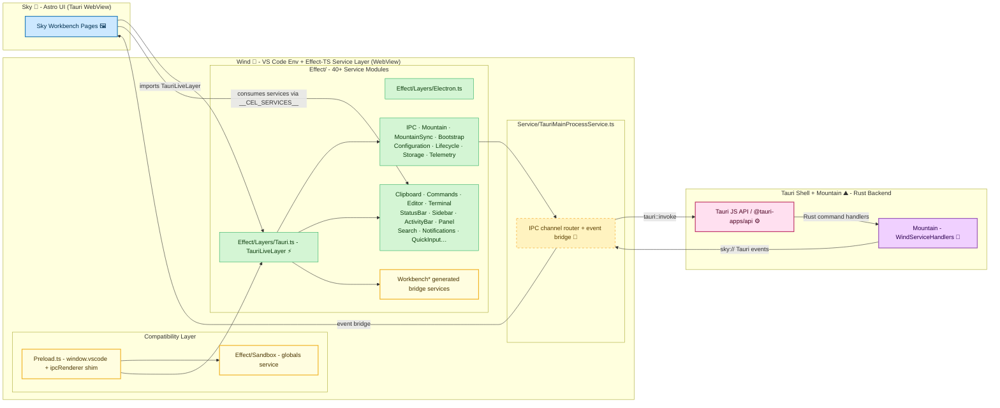

# **Wind**&#x2001;🍃

<table>
	<tr>
		<td>
			<a href="https://GitHub.Com/CodeEditorLand/Wind" target="_blank">
				<picture>
					<source media="(prefers-color-scheme: dark)" srcset="https://img.shields.io/github/last-commit/CodeEditorLand/Wind?label=Update&color=black&labelColor=black&logoColor=white&logoWidth=0" />
					<source media="(prefers-color-scheme: light)" srcset="https://img.shields.io/github/last-commit/CodeEditorLand/Wind?label=Update&color=white&labelColor=white&logoColor=black&logoWidth=0" />
					
				</picture>
			</a>
			<br />
			<a href="https://GitHub.Com/CodeEditorLand/Wind" target="_blank">
				<picture>
					<source media="(prefers-color-scheme: dark)" srcset="https://img.shields.io/github/issues/CodeEditorLand/Wind?label=Issue&color=black&labelColor=black&logoColor=white&logoWidth=0" />
					<source media="(prefers-color-scheme: light)" srcset="https://img.shields.io/github/issues/CodeEditorLand/Wind?label=Issue&color=white&labelColor=white&logoColor=black&logoWidth=0" />
					
				</picture>
			</a>
		</td>
		<td>
			<a href="https://github.com/CodeEditorLand/Wind" target="_blank">
				<picture>
					<source media="(prefers-color-scheme: dark)" srcset="https://img.shields.io/github/stars/CodeEditorLand/Wind?style=flat&label=Star&logo=github&color=black&labelColor=black&logoColor=white&logoWidth=0" />
					<source media="(prefers-color-scheme: light)" srcset="https://img.shields.io/github/stars/CodeEditorLand/Wind?style=flat&label=Star&logo=github&color=white&labelColor=white&logoColor=black&logoWidth=0" />
					
				</picture>
			</a>
			<br />
			<a href="https://GitHub.Com/CodeEditorLand/Wind" target="_blank">
				<picture>
					<source media="(prefers-color-scheme: dark)" srcset="https://img.shields.io/github/downloads/CodeEditorLand/Wind/total?label=Download&color=black&labelColor=black&logoColor=white&logoWidth=0" />
					<source media="(prefers-color-scheme: light)" srcset="https://img.shields.io/github/downloads/CodeEditorLand/Wind/total?label=Download&color=white&labelColor=white&logoColor=black&logoWidth=0" />
					
				</picture>
			</a>
		</td>
	</tr>
</table>

The `TypeScript`/`Effect-TS` Service Layer for Land&#x2001;🏞️

> **`Electron`'s `IPC` bridge forces every panel interaction through untyped
> `JSON` serialization - brittle, untyped, and opaque. `Wind` replaces it with
> typed `Tauri` commands routed to `Rust` handlers in `Mountain`'s core.**

_"Every service is a typed `Effect`. Every call is traced. Every error is
tagged. The bridge is not a black box - it's an open, composable, effectful
program."_

[](https://github.com/CodeEditorLand/Wind/tree/Current/LICENSE)
[](https://www.npmjs.com/package/@codeeditorland/wind)
[](https://www.npmjs.com/package/@tauri-apps/api)
[](https://www.npmjs.com/package/effect)

---

## Overview

**Wind** is the `TypeScript`/`Effect-TS` service layer that bridges `Sky`
(Land's VS Code-based UI) to the `Tauri` desktop shell and `Mountain`'s `Rust`
backend. It replaces `VS Code`'s `Electron` `IPC` bridge - which forces every
panel interaction through untyped `JSON` serialization - with typed `Tauri`
commands routed to `Rust` handlers in `Mountain`'s core. It provides the
`Effect-TS` native service layer that enables `Sky` to function within the
`Tauri` shell.

`Wind` recreates the essential VS Code renderer environment, implements core
services through `Effect-TS`'s typed error and dependency injection patterns,
and connects the frontend to `Mountain`'s `Rust` backend through `Tauri`'s
`invoke` and `event` system. It exposes `Tauri`'s native OS file dialogs through
`Effect-TS` wrappers that surface typed, tagged errors. The `Preload.ts` script
establishes `window.vscode` and shims `ipcRenderer` and `process` so VS Code
workbench code communicates through `Tauri`'s `invoke` system instead of
`Electron`'s `IPC`.

`Wind` is engineered to:

1. **Provide a Typed Service Layer** - Replace `Electron`'s untyped `JSON` `IPC`
   with `Effect-TS` services that carry typed tags, composable `Layer`s, and
   deterministic dependency injection.
2. **Emulate the VS Code Renderer Environment** - Shim `Electron` and `Node.js`
   APIs so VS Code workbench code runs unchanged inside the `Tauri` `WebView`.
3. **Route Through Tauri Commands** - Connect every frontend request to
   `Mountain`'s `Rust` handlers via Tauri's typed `invoke` and `event` system,
   avoiding raw serialization boundaries.
4. **Enable Code Generation** - Walk the VS Code service catalog, extract
   interface signatures and command registrations, and emit bridge shapes and
   catalogs for the full workbench surface.

---

## Key Features&#x2001;🔐

**`Effect-TS` Service Architecture** - 40+ service modules, each structured as
an atomic unit with `Tag`, `Interface`, `Implementation`, `Layer`, `Type`, and
`Error` subdirectories. Every service is a typed `Effect` that composes via
`Layer` into `TauriLiveLayer`, `ElectronLiveLayer`, and `TestLayer` stacks.

**`Preload.ts` Environment Emulation** - Shims `Electron`'s `ipcRenderer`,
`process`, `require`, and `Node.js` globals, establishing `window.vscode` and a
compatible execution context inside the `Tauri` `WebView`. VS Code workbench
code runs without modification.

**Typed IPC over Tauri** - Replaces `Electron`'s `ipcMain`/`ipcRenderer` with
typed `Tauri` `invoke` and `listen` calls through `Effect/IPC`. Every invocation
carries a tagged error type (`IPCError`) and is routed through the
`Service/TauriMainProcessService.ts` channel router.

**Codegen Pipeline** - The `Codegen/` directory walks the VS Code workbench
service catalog, extracts decorators and interface members, resolves cross-file
references, and emits `BridgeShape` files, service catalogs, and command
registrations. Generated bridges power the `Workbench*` services in `Effect/`.

**`Mountain` RPC Service** - Maintains a typed `RPC` connection to the `Rust`
backend for configuration synchronization, state management, and native
operations. The `MountainSync` sub-service performs background polling for
configuration changes.

**File System Provider** - A VS Code-compatible `FileSystemProvider` with
`MountainCommands` bridge, type-safe `URI` handling, and tagged
`FileSystemProviderError`s. Exposes `Tauri`'s native OS file dialogs through
`Effect-TS` wrappers.

**Telemetry Integration** - `PostHog` bridge with browser and server-side
tracking, configuration-driven feature flags, fallback persistence, and
`Effect-TS` spans and metrics helpers.

**Layer Composition** - Three pre-composed layer stacks: `TauriLiveLayer` (full
production stack with 40+ services), `ElectronLiveLayer` (compatibility layer
for `Electron`-based testing), and `TestLayer` (isolated mock layer for unit
testing).

---

## Core Architecture Principles&#x2001;🏗️

| Principle         | Description                                                                                                                                                                  | Key Components                                                                            |
| ----------------- | ---------------------------------------------------------------------------------------------------------------------------------------------------------------------------- | ----------------------------------------------------------------------------------------- |
| **Compatibility** | High-fidelity VS Code renderer environment to maximize `Sky`'s reusability. Shim every `Electron` API the workbench expects.                                                 | `Preload.ts`, `Bootstrap/Types/`, `Types/`                                                |
| **Modularity**    | Each service follows an atomic directory structure with `Interface`, `Implementation`, `Tag`, `Layer`, `Type`, and `Error` subdirectories.                                   | All `Effect/` services                                                                    |
| **Type Safety**   | `Effect-TS` powers all service implementations, ensuring tagged error types, composable `Layer` dependency injection, and deterministic error handling.                      | All `Effect/` services with `Layer` and `Tag` patterns                                    |
| **Abstraction**   | Clean `Layer` over `Tauri` APIs replaces untyped `Electron` `IPC` with typed `Tauri` commands. The frontend never touches raw `invoke` calls.                                | `Preload.ts`, `Effect/IPC/`, `Effect/Mountain/`                                           |
| **Integration**   | `Sky`'s frontend requests connect to `Mountain`'s backend through `Tauri`'s `invoke` and `event` system. The `ipcRenderer` shim routes every call through the `IPC` service. | `Preload.ts` (ipcRenderer shim), `Effect/Mountain/`, `Service/TauriMainProcessService.ts` |

---

## System Architecture



**Connection paths:**

| Path                               | Protocol                                                      | Use Case                               |
| ---------------------------------- | ------------------------------------------------------------- | -------------------------------------- |
| Wind → Mountain via `Tauri invoke` | `Tauri` IPC (typed commands)                                  | All frontend-to-backend requests       |
| Mountain → Wind via `Tauri listen` | `Tauri` event system (`sky://` events)                        | Backend notifications and state pushes |
| Wind → Sky                         | Direct import of `TauriLiveLayer` + `__CEL_SERVICES__` global | UI service consumption                 |
| Preload → Tauri                    | `window.__TAURI__` bridge                                     | Environment emulation and API shims    |

---

## Key Components

| Component             | Path                                 | Description                                                                                   |
| --------------------- | ------------------------------------ | --------------------------------------------------------------------------------------------- |
| Preload Shim          | `Source/Preload.ts`                  | VS Code environment emulation in Tauri WebView - shims Electron APIs, creates `window.vscode` |
| IPC Service           | `Source/Effect/IPC/`                 | Inter-process communication via Tauri `invoke` with typed, tagged errors                      |
| Mountain RPC          | `Source/Effect/Mountain/`            | Backend RPC connection service for configuration, state, and native operations                |
| Mountain Sync         | `Source/Effect/MountainSync/`        | Background configuration synchronization with change detection                                |
| Configuration         | `Source/Effect/Configuration/`       | Workbench configuration with sync and change detection                                        |
| Bootstrap             | `Source/Effect/Bootstrap/`           | Multi-stage bootstrap orchestration for service initialization                                |
| Codegen               | `Source/Codegen/`                    | VS Code service code generator - walks service catalog, emits bridge shapes                   |
| Sandbox               | `Source/Effect/Sandbox/`             | Preload globals and environment service                                                       |
| Telemetry             | `Source/Effect/Telemetry/`           | Logging, spans, and metrics (PostHog/OTLP)                                                    |
| Environment           | `Source/Effect/Environment/`         | System and platform detection                                                                 |
| Health                | `Source/Effect/Health/`              | Service health checks                                                                         |
| Clipboard             | `Source/Effect/Clipboard/`           | System clipboard access                                                                       |
| Commands              | `Source/Effect/Commands/`            | VS Code command registry                                                                      |
| Editor                | `Source/Effect/Editor/`              | Editor service abstraction                                                                    |
| Activity Bar          | `Source/Effect/ActivityBar/`         | Activity bar management                                                                       |
| Panel                 | `Source/Effect/Panel/`               | Bottom panel management                                                                       |
| Sidebar               | `Source/Effect/Sidebar/`             | Sidebar management                                                                            |
| Status Bar            | `Source/Effect/StatusBar/`           | Status bar management                                                                         |
| Decorations           | `Source/Effect/Decorations/`         | Editor decoration service                                                                     |
| Extensions            | `Source/Effect/Extensions/`          | Extension management                                                                          |
| Files                 | `Source/Effect/Files/`               | File system operations                                                                        |
| History               | `Source/Effect/History/`             | Editor history service                                                                        |
| Keybinding            | `Source/Effect/Keybinding/`          | Keyboard shortcut binding                                                                     |
| Label                 | `Source/Effect/Label/`               | Label service                                                                                 |
| Language              | `Source/Effect/Language/`            | Language service                                                                              |
| Lifecycle             | `Source/Effect/Lifecycle/`           | Application lifecycle                                                                         |
| Model                 | `Source/Effect/Model/`               | Text model service                                                                            |
| Notification          | `Source/Effect/Notification/`        | Notification service                                                                          |
| Output                | `Source/Effect/Output/`              | Output panel service                                                                          |
| Progress              | `Source/Effect/Progress/`            | Progress indication                                                                           |
| Quick Input           | `Source/Effect/QuickInput/`          | Quick input UI                                                                                |
| Search                | `Source/Effect/Search/`              | Search service                                                                                |
| Storage               | `Source/Effect/Storage/`             | Persistent storage                                                                            |
| Terminal              | `Source/Effect/Terminal/`            | Terminal service                                                                              |
| Text File             | `Source/Effect/TextFile/`            | Text file service                                                                             |
| Text Model Resolver   | `Source/Effect/TextModelResolver/`   | Text model resolver                                                                           |
| Themes                | `Source/Effect/Themes/`              | Theme management                                                                              |
| Working Copy          | `Source/Effect/WorkingCopy/`         | Working copy service                                                                          |
| Workspaces            | `Source/Effect/Workspaces/`          | Workspace management                                                                          |
| Network Restrictions  | `Source/Effect/NetworkRestrictions/` | Network access restrictions                                                                   |
| User Settings         | `Source/Effect/UserSettings/`        | User settings bridge                                                                          |
| Vine                  | `Source/Effect/Vine/`                | Notification stream                                                                           |
| Layers/Tauri          | `Source/Effect/Layers/Tauri.ts`      | Primary composed layer merging 40+ services into `TauriLiveLayer`                             |
| Layers/Electron       | `Source/Effect/Layers/Electron.ts`   | Electron compatibility layer stack                                                            |
| Layers/Test           | `Source/Effect/Layers/Test.ts`       | Test/mock layer stack for isolated testing                                                    |
| File System Provider  | `Source/FileSystem/`                 | VS Code-compatible file system provider with Mountain bridge                                  |
| Workbench Integration | `Source/Workbench/`                  | Workbench integration service                                                                 |
| Function/Install      | `Source/Function/Install/`           | Preload install helpers and IPC renderer creation                                             |
| Service               | `Source/Service/`                    | Tauri main process service, channel routing, WebSocket transport                              |
| Types                 | `Source/Types/`                      | Sandbox, IPC, and error type definitions                                                      |
| Utility               | `Source/Utility/`                    | Shared utility functions                                                                      |

---

## Project Structure&#x2001;🗺️

```
Wind/
├── Source/
│   ├── Preload.ts                     # VS Code environment emulation in Tauri WebView
│   ├── ESBuild.ts                     # ESBuild bundling configuration
│   ├── Effect/                        # Effect-TS services (atomic structure)
│   │   ├── index.ts                   # Service module re-exports
│   │   ├── IPC.ts, IPC/              # Inter-process communication via Tauri invoke
│   │   ├── Sandbox/                   # Preload globals and environment service
│   │   ├── Configuration/             # Workbench configuration with sync
│   │   ├── Telemetry/                 # Logging, spans, and metrics (PostHog/OTLP)
│   │   ├── Mountain/                  # Backend RPC connection service
│   │   ├── MountainSync/              # Background configuration sync
│   │   ├── Environment/               # System and platform detection
│   │   ├── Health/                    # Service health checks
│   │   ├── Bootstrap/                 # Multi-stage bootstrap orchestration
│   │   ├── Clipboard/                 # System clipboard access
│   │   ├── Commands/                  # VS Code command registry
│   │   ├── Editor/                    # Editor service abstraction
│   │   ├── ActivityBar/               # Activity bar management
│   │   ├── Panel/                     # Bottom panel management
│   │   ├── Sidebar/                   # Sidebar management
│   │   ├── StatusBar/                 # Status bar management
│   │   ├── Decorations/               # Editor decorations service
│   │   ├── Extensions/                # Extension management
│   │   ├── Files/                     # File system operations
│   │   ├── History/                   # Editor history service
│   │   ├── Keybinding/                # Keyboard shortcut binding
│   │   ├── Label/                     # Label service
│   │   ├── Language/                  # Language service
│   │   ├── Lifecycle/                 # Application lifecycle
│   │   ├── Model/                     # Text model service
│   │   ├── Notification/              # Notification service
│   │   ├── Output/                    # Output panel service
│   │   ├── Progress/                  # Progress indication
│   │   ├── QuickInput/                # Quick input UI
│   │   ├── Search/                    # Search service
│   │   ├── Storage/                   # Persistent storage
│   │   ├── Terminal/                  # Terminal service
│   │   ├── TextFile/                  # Text file service
│   │   ├── TextModelResolver/         # Text model resolver
│   │   ├── Themes/                    # Theme management
│   │   ├── WorkingCopy/               # Working copy service
│   │   ├── Workspaces/                # Workspace management
│   │   ├── NetworkRestrictions/       # Network access restrictions
│   │   ├── UserSettings/              # User settings bridge
│   │   ├── Vine/                      # Notification stream
│   │   ├── LandWorkbench/             # Land workbench integration
│   │   ├── Generated/                 # Auto-generated VS Code service interfaces
│   │   ├── WorkbenchActivity/         # Generated workbench activity bridge
│   │   ├── WorkbenchClipboard/        # Generated workbench clipboard bridge
│   │   ├── WorkbenchCommand/          # Generated workbench command bridge
│   │   ├── WorkbenchContextKey/       # Generated workbench context key bridge
│   │   ├── WorkbenchDialog/           # Generated workbench dialog bridge
│   │   ├── WorkbenchEditor/           # Generated workbench editor bridge
│   │   ├── WorkbenchExtension/        # Generated workbench extension bridge
│   │   ├── WorkbenchHost/             # Generated workbench host bridge
│   │   ├── WorkbenchKeybinding/       # Generated workbench keybinding bridge
│   │   ├── WorkbenchLayout/           # Generated workbench layout bridge
│   │   ├── WorkbenchLifecycle/        # Generated workbench lifecycle bridge
│   │   ├── WorkbenchNotification/     # Generated workbench notification bridge
│   │   ├── WorkbenchProduct/          # Generated workbench product bridge
│   │   ├── WorkbenchProgress/         # Generated workbench progress bridge
│   │   ├── WorkbenchStorage/          # Generated workbench storage bridge
│   │   ├── WorkbenchTheme/            # Generated workbench theme bridge
│   │   └── WorkbenchWorkspace/        # Generated workbench workspace bridge
│   ├── Bootstrap/                     # Bootstrap type definitions for startup
│   │   └── Types/                     # VS Code type shims (services, configuration, platform)
│   ├── Codegen/                       # VS Code service code generator
│   │   ├── Codegen.ts                 # Main codegen entry point
│   │   ├── RunCodegen.ts              # Codegen runner
│   │   ├── Walk/                      # Source tree walker
│   │   ├── Extract/                   # Decorator and interface extraction
│   │   ├── Resolve/                   # Cross-file interface resolution
│   │   ├── Emit/                      # Bridge shape and catalog emission
│   │   ├── Manifest/                  # Bridge shape manifest
│   │   └── Type/                      # Codegen type definitions
│   ├── Configuration/                 # ESBuild and TypeScript configurations
│   ├── FileSystem/                    # VS Code-like file system provider
│   │   ├── Type/                      # File type and URI definitions
│   │   ├── Interface/                 # FileSystemProvider interface
│   │   ├── Implementation/            # Provider implementation and Mountain bridge
│   │   └── Error/                     # FileSystemProvider error types
│   ├── Function/                      # Preload install helpers and IPC renderer creation
│   ├── IPC/                           # IPC channel and Sky event definitions
│   ├── Service/                       # Tauri main process service
│   │   ├── TauriMainProcessService.ts # IPC channel router and event bridge
│   │   ├── MountainInvoke.ts          # Mountain backend invocation
│   │   ├── ChannelRouteMap.ts         # Channel routing configuration
│   │   ├── StubChannels.ts            # Channel stubs for testing
│   │   └── MistWebSocketTransport.ts  # WebSocket message transport
│   ├── Telemetry/                     # PostHog telemetry bridge
│   ├── Types/                         # Sandbox, IPC, and error type definitions
│   │   ├── Interface/                 # WebUtils, WebFrame, ProcessEnvironment, etc.
│   │   └── Error/                     # IPCChannelError, SandboxNotReadyError, etc.
│   ├── Utility/                       # Shared utility functions
│   └── Workbench/                     # Workbench integration service
│       ├── Type/                      # WorkbenchIntegrationType
│       ├── Interface/                 # WorkbenchIntegrationService
│       └── Implementation/            # WorkbenchIntegrationImplementation
└── Documentation/                     # Project documentation
```

---

## In the Land Project

`Wind` is the middle layer between `Sky` (the UI) and `Tauri` / `Mountain` (the
backend). It provides the service abstraction that `Sky` consumes to perform
file operations, dialogs, configuration, and state management - all through
typed, tagged `Effect` services rather than untyped `IPC`. Communication flows
through `Tauri`'s `invoke` (request) and `event` (notification) channels.

| Host       | Language                   | Runtime                          | IPC Bridge                           |
| ---------- | -------------------------- | -------------------------------- | ------------------------------------ |
| **Wind**   | `TypeScript`               | `Effect-TS` in `Tauri` `WebView` | Typed `Tauri` `invoke`/`listen`      |
| **Grove**  | `Rust`, `WASM`             | `WASMtime`                       | `gRPC`, `IPC`, `WASM` host functions |
| **Cocoon** | `TypeScript`, `JavaScript` | `Node.js` via `Effect-TS`        | `Electron` `IPC` or `Wind` bridge    |

- **Depends on:** `Mountain` (`Rust` backend handlers), `Tauri`
  (`invoke`/`event` system), `@tauri-apps/api` (typed JS bridge)
- **Consumed by:** `Sky` (Astro UI layer), `Cocoon` (extension host), `Worker`
  (service worker)
- **Protocol:** `Tauri` IPC (`invoke` + `listen`)

---

## Getting Started&#x2001;🚀

### Installation

```sh
pnpm add @codeeditorland/wind
```

### Key Dependencies

| Package                  | Version  | Purpose                     |
| :----------------------- | :------- | :-------------------------- |
| `@tauri-apps/api`        | `2.11.0` | Tauri JS bridge             |
| `@codeeditorland/output` | `0.0.1`  | Shared output utilities     |
| `effect`                 | `3.21.2` | Structured concurrency & DI |
| `typescript`             | `6.0.3`  | TypeScript compilation      |

### Usage

`Wind` is integrated via its `Preload.ts` script and `Effect-TS` layers.

1. **Integrate the Preload Script:** Configure `tauri.config.json` to include
   the bundled `Preload.js` from Wind in your main window's preload scripts.

2. **Use Services with `Effect-TS`:**

```ts
import { IPC } from "@codeeditorland/wind/Effect";
import { TauriLiveLayer } from "@codeeditorland/wind/Effect/Layers/Tauri";
import { Effect, Layer, Runtime } from "effect";

// Build the application runtime with Tauri live layer
const AppRuntime = Layer.toRuntime(TauriLiveLayer).pipe(
	Effect.scoped,
	Effect.runSync,
);

// Example: invoke a Tauri command through the typed IPC service
const InvokeEffect = Effect.gen(function* (_) {
	const IPCService = yield* _(IPC);
	const Result = yield* _(
		IPCService.invoke("mountain_get_workbench_configuration"),
	);
	yield* _(Effect.log(`Configuration received: ${JSON.stringify(Result)}`));
});

Runtime.runPromise(AppRuntime, InvokeEffect);
```

### Available Effect Services

| Service               | Import Path                                   | Description                           |
| :-------------------- | :-------------------------------------------- | :------------------------------------ |
| `IPC`                 | `@codeeditorland/wind/Effect`                 | Inter-process communication via Tauri |
| `Sandbox`             | `@codeeditorland/wind/Effect`                 | Preload globals and environment       |
| `Configuration`       | `@codeeditorland/wind/Effect`                 | Workbench configuration with sync     |
| `Telemetry`           | `@codeeditorland/wind/Effect`                 | Logging, spans, and metrics           |
| `Mountain`            | `@codeeditorland/wind/Effect`                 | Backend RPC connection                |
| `MountainSync`        | `@codeeditorland/wind/Effect`                 | Background configuration sync         |
| `Environment`         | `@codeeditorland/wind/Effect`                 | System and platform detection         |
| `Health`              | `@codeeditorland/wind/Effect`                 | Service health checks                 |
| `Bootstrap`           | `@codeeditorland/wind/Effect`                 | Multi-stage bootstrap orchestration   |
| `Clipboard`           | `@codeeditorland/wind/Effect`                 | System clipboard access               |
| `Commands`            | `@codeeditorland/wind/Effect`                 | VS Code command registry              |
| `Editor`              | `@codeeditorland/wind/Effect`                 | Editor service abstraction            |
| `ActivityBar`         | `@codeeditorland/wind/Effect`                 | Activity bar management               |
| `Panel`               | `@codeeditorland/wind/Effect`                 | Bottom panel management               |
| `Sidebar`             | `@codeeditorland/wind/Effect`                 | Sidebar management                    |
| `StatusBar`           | `@codeeditorland/wind/Effect`                 | Status bar management                 |
| `Decorations`         | `@codeeditorland/wind/Effect`                 | Editor decoration service             |
| `Extensions`          | `@codeeditorland/wind/Effect`                 | Extension management                  |
| `Files`               | `@codeeditorland/wind/Effect`                 | File system operations                |
| `History`             | `@codeeditorland/wind/Effect`                 | Editor history                        |
| `Keybinding`          | `@codeeditorland/wind/Effect`                 | Keyboard shortcut binding             |
| `Label`               | `@codeeditorland/wind/Effect`                 | Label service                         |
| `Language`            | `@codeeditorland/wind/Effect`                 | Language service                      |
| `Lifecycle`           | `@codeeditorland/wind/Effect`                 | Application lifecycle                 |
| `Model`               | `@codeeditorland/wind/Effect`                 | Text model service                    |
| `Notification`        | `@codeeditorland/wind/Effect`                 | Notification service                  |
| `Output`              | `@codeeditorland/wind/Effect`                 | Output panel service                  |
| `Progress`            | `@codeeditorland/wind/Effect`                 | Progress indication                   |
| `QuickInput`          | `@codeeditorland/wind/Effect`                 | Quick input UI                        |
| `Search`              | `@codeeditorland/wind/Effect`                 | Search service                        |
| `Storage`             | `@codeeditorland/wind/Effect`                 | Persistent storage                    |
| `Terminal`            | `@codeeditorland/wind/Effect`                 | Terminal service                      |
| `TextFile`            | `@codeeditorland/wind/Effect`                 | Text file service                     |
| `TextModelResolver`   | `@codeeditorland/wind/Effect`                 | Text model resolver                   |
| `Themes`              | `@codeeditorland/wind/Effect`                 | Theme management                      |
| `WorkingCopy`         | `@codeeditorland/wind/Effect`                 | Working copy service                  |
| `Workspaces`          | `@codeeditorland/wind/Effect`                 | Workspace management                  |
| `NetworkRestrictions` | `@codeeditorland/wind/Effect`                 | Network access restrictions           |
| `UserSettings`        | `@codeeditorland/wind/Effect`                 | User settings bridge                  |
| `Vine`                | `@codeeditorland/wind/Effect`                 | Notification stream                   |
| `LandWorkbench`       | `@codeeditorland/wind/Effect`                 | Land workbench integration            |
| `Layers/Tauri`        | `@codeeditorland/wind/Effect/Layers/Tauri`    | Complete Tauri layer stack            |
| `Layers/Electron`     | `@codeeditorland/wind/Effect/Layers/Electron` | Electron compatibility layer stack    |
| `Layers/Test`         | `@codeeditorland/wind/Effect/Layers/Test`     | Test/mock layer stack                 |
| `FileSystem`          | `@codeeditorland/wind/FileSystem`             | VS Code-like file system provider     |
| `Workbench`           | `@codeeditorland/wind/Workbench`              | Workbench integration service         |

---

## Security&#x2001;🔒

Wind enforces security at multiple layers:

| Layer                    | Mechanism                                                                                                               |
| ------------------------ | ----------------------------------------------------------------------------------------------------------------------- |
| **Type safety**          | Full `TypeScript` / `Effect-TS` type system across all service boundaries - every invocation carries tagged error types |
| **IPC isolation**        | All backend communication flows through typed `Tauri` commands, not raw `JSON` serialization                            |
| **Sandbox**              | The `Sandbox` service controls what globals and APIs are exposed to the `WebView` renderer                              |
| **Network restrictions** | The `NetworkRestrictions` service enforces access controls and blocks unauthorized outbound requests                    |
| **Dependency injection** | `Effect-TS` `Layer` system ensures services only receive their declared dependencies - no ambient access to globals     |
| **Telemetry privacy**    | `PostHog` configuration supports opt-out, anonymous identifiers, and fallback persistence without PII                   |

---

## Compatibility

Wind is designed to be compatible with:

| Target       | Integration                                                                                 |
| ------------ | ------------------------------------------------------------------------------------------- |
| **Sky**      | Consumes Wind services via `TauriLiveLayer` and `__CEL_SERVICES__` global                   |
| **VS Code**  | Emulates `vscode.d.ts` environment through `Preload.ts` shims and `Bootstrap/Types/VSCode/` |
| **Mountain** | Connects via typed `Tauri` `invoke`/`listen` to `WindServiceHandlers`                       |
| **Cocoon**   | Shares service interface surface and `Effect-TS` dependency injection patterns              |
| **Tauri**    | Integrates via `@tauri-apps/api` `v2.11.0` with typed command routing                       |

---

## API Reference

- **[Effect Service Interfaces](https://github.com/CodeEditorLand/Wind/tree/Current/Source/Effect/)**
    - All `Effect-TS` service tags, interfaces, and implementations
- **[Preload API](https://github.com/CodeEditorLand/Wind/tree/Current/Source/Preload.ts)**
    - Environment shim and `window.vscode` globals
- **[Layer Compositions](https://github.com/CodeEditorLand/Wind/tree/Current/Source/Effect/Layers/)**
    - `Tauri`, `Electron`, and `Test` layer stacks
- **[Codegen Documentation](https://github.com/CodeEditorLand/Wind/tree/Current/Source/Codegen/)**
    - Service catalog walker, interface extraction, and bridge shape generation

---

## Related Documentation

- [Architecture Overview](https://Editor.Land/Doc/architecture) - Internal
  module structure
- [Why Effect-TS](https://Editor.Land/Doc/why-effect-ts) - Design rationale for
  `Effect-TS`
- [Why Tauri](https://Editor.Land/Doc/why-tauri) - Design rationale for `Tauri`
- [Land Documentation](../../Documentation/GitHub/README.md) - Complete
  documentation index
- [Sky 🌌](https://github.com/CodeEditorLand/Sky) - UI component layer that
  consumes Wind services
- [Cocoon 🦋](https://github.com/CodeEditorLand/Cocoon) - Extension host sidecar
  (correlated frontend element)
- [Worker 🍩](https://github.com/CodeEditorLand/Worker) - Service worker for
  caching and offline support
- [Mountain ⛰️](https://github.com/CodeEditorLand/Mountain) - Native desktop
  shell and `gRPC` backend

---

## License

This project is released into the public domain under the **Creative Commons CC0
Universal** license. You are free to use, modify, distribute, and build upon
this work for any purpose, without any restrictions. For the full legal text,
see the [`LICENSE`](https://github.com/CodeEditorLand/Wind/tree/Current/LICENSE)
file.

---

## Changelog

See
[`CHANGELOG.md`](https://github.com/CodeEditorLand/Wind/tree/Current/CHANGELOG.md)
for a history of changes specific to **Wind** 🌬️.

---

## Funding & Acknowledgements&#x2001;🙏🏻

This project is funded through
[NGI0 Commons Fund](https://NLnet.NL/commonsfund), a fund established by
[NLnet](https://NLnet.NL) with financial support from the European Commission's
Next Generation Internet program, under grant agreement No 101135429.

The project is operated by PlayForm, based in Sofia, Bulgaria. PlayForm acts as
the open-source steward for Code Editor Land under the NGI0 Commons Fund grant.

<table>
	<tbody>
		<tr>
			<td align="left" valign="middle">
				<a href="https://Editor.Land">
					
				</a>
			</td>
			<td align="left" valign="middle">
				<a href="https://PlayForm.Cloud">
					
				</a>
			</td>
			<td align="left" valign="middle">
				<a href="https://NLnet.NL">
					
				</a>
			</td>
			<td align="left" valign="middle">
				<a href="https://NLnet.NL/commonsfund">
					
				</a>
			</td>
		</tr>
	</tbody>
</table>

---

**Project Maintainers**: Source Open
([Source/Open@editor.land](mailto:Source/Open@editor.land)) |
[GitHub Repository](https://github.com/CodeEditorLand/Wind) |
[Report an Issue](https://github.com/CodeEditorLand/Wind/issues) |
[Security Policy](https://github.com/CodeEditorLand/Wind/security/policy)
