<table><tr>
<td colspan="1"> <h3 align="center"> <picture>
<source media="(prefers-color-scheme: dark)" srcset="https://PlayForm.Cloud/Dark/Image/GitHub/Land.svg">
<source media="(prefers-color-scheme: light)" srcset="https://PlayForm.Cloud/Image/GitHub/Land.svg">

</picture> </h3> </td> <td colspan="3" valign="top"> <h3 align="center"> Wind 🍃
</h3> </td>
</tr></table>

# **Wind** 🍃 The Breath of Land: VSCode Environment & Services for Tauri

[](https://github.com/CodeEditorLand/Wind/blob/Current/LICENSE)
[](https://www.npmjs.com/package/@codeeditorland/wind)
[](https://www.npmjs.com/package/@tauri-apps/api)
[](https://www.npmjs.com/package/effect)

Welcome to **Wind**! This element is the vital **Effect-TS native service
layer** that allows `Sky` (Land's VSCode-based UI) to breathe and function
within the **Tauri** shell. **Wind** meticulously recreates essential parts of
the VSCode renderer environment, provides robust implementations of core
services (like file dialogs and configuration), and integrates seamlessly with
the `Mountain` backend via Tauri APIs. It replaces Electron-based
implementations with high-performance, OS-native equivalents, all underpinned by
**Effect-TS** for resilience and type safety.

**Wind** is engineered to:

1.  **Emulate the VSCode Sandbox:** Through a sophisticated `Preload.ts` script,
    it shims critical Electron and Node.js APIs that VSCode's workbench code
    expects, creating a compatible execution context.
2.  **Implement Core VSCode Services:** It provides frontend implementations for
    key VSCode services (e.g., `IFileDialogService`), leveraging `Effect-TS` for
    highly reliable, composable, and maintainable logic.
3.  **Integrate with Tauri & Native Capabilities:** It offers a clean
    abstraction layer over Tauri APIs for file operations, dialogs, and OS
    information, making them accessible in a type-safe way through Effect-based
    wrappers.

## Key Features 🔐

- **Native Dialog Experience:** Implements VSCode's `IFileDialogService` for
  File Open/Save dialogs using Tauri's native OS dialogs.
- **VSCode Environment Compliance:** A sophisticated `Preload.ts` script
  establishes the crucial `window.vscode` global object, shimming `ipcRenderer`
  and `process` to bridge the gap between the VSCode workbench code and the
  Tauri runtime.
- **Effect-TS Powered Architecture:** Employs `Effect` for all asynchronous
  operations and service logic, ensuring that all potential failures are
  explicitly handled as typed, tagged errors for maximum robustness.
- **Declarative Dependency Management:** Uses `Layer` and `Context.Tag` from
  `Effect-TS` for clean dependency injection and composable service construction
  via a single master `AppLayer`.
- **Clean Integration Layer:** Provides a clear abstraction layer over Tauri
  APIs, isolating platform specifics and simplifying their usage within the
  application.

## Core Architecture Principles 🏗️

| Principle         | Description                                                                                                                               | Key Components Involved                           |
| :---------------- | :---------------------------------------------------------------------------------------------------------------------------------------- | :------------------------------------------------ |
| **Compatibility** | Provide a high-fidelity VSCode renderer environment to maximize `Sky`'s reusability and minimize changes needed for VSCode UI components. | `Preload.ts`, `Platform/VSCode/*`                 |
| **Modularity**    | Components (preload, services, integrations) are organized into distinct, cohesive modules for clarity and maintainability.               | `Application/*`, `Integration/*`, `Platform/*`    |
| **Robustness**    | Leverage `Effect-TS` for all service implementations and asynchronous operations, ensuring predictable error handling and composability.  | All `Effect`-based modules                        |
| **Abstraction**   | Create a clean `Integration` layer over Tauri APIs, isolating platform specifics and simplifying their usage within the application.      | `Integration/Tauri/Wrap/*`, `Preload.ts`          |
| **Integration**   | Seamlessly connect `Sky`'s frontend requests with `Mountain`'s backend capabilities through Tauri's `invoke`/event system.                | `Preload.ts` (ipcRenderer shim), `HostServiceTag` |

---

## Deep Dive & Component Breakdown 🔬

To understand how `Wind`'s internal components interact to provide these
services, please refer to the detailed technical breakdown in
[`docs/Deep Dive.md`](docs/Deep%20Dive.md). This document explains the role of
the `Preload` script, the `Integration` layer, and how the `Application`
services are constructed with Effect-TS.

---

## `Wind` in the Land Ecosystem 🍃 + 🏞️

This diagram illustrates `Wind`'s central role between `Sky` (the UI) and the
Tauri/`Mountain` (backend) environment.

```mermaid
graph LR
	classDef sky fill:#9cf,stroke:#333,stroke-width:2px;
	classDef wind fill:#ffc,stroke:#333,stroke-width:2px;
	classDef tauri fill:#f9d,stroke:#333,stroke-width:2px;
	classDef mountain fill:#f9f,stroke:#333,stroke-width:2px;
	classDef effectts fill:#cfc,stroke:#333,stroke-width:1px;


	subgraph "Sky (Frontend UI - Tauri Webview)"
		SkyApp["Sky Application Code (VSCode UI Components)"]:::sky
	end

	subgraph "Wind (VSCode Env & Services Layer - Runs in Webview)"
		PreloadJS["Preload.js (Environment Shim)"]:::wind
		WindEffectTSRuntime["Wind Effect-TS Runtime & Service Layers"]:::effectts
		TauriIntegrations["Wind/Integration/Tauri (Tauri API Wrappers)"]:::wind

		SkyApp -- Consumes services from --> WindEffectTSRuntime;
		WindEffectTSRuntime -- Executes side-effects via --> TauriIntegrations;
	end

	subgraph "Tauri Core & Mountain (Rust Backend)"
		TauriAPIs["Tauri JS API & Plugins"]:::tauri
		MountainBackend["Mountain Rust Core (Command Handlers)"]:::mountain
	end

    TauriWindow["Tauri Window"] -- Loads --> PreloadJS
    PreloadJS -- Prepares environment for --> SkyApp

	TauriIntegrations -- Calls --> TauriAPIs;
    TauriAPIs -- Communicates with --> MountainBackend;
```



---

## Project Structure Overview 🗺️

The `Wind` repository is organized to clearly separate concerns:

```
Wind/
└── Source/
    ├── Preload.ts                   # Core script for VSCode environment emulation in Tauri.
    ├── Application/                 # Core frontend service implementations (e.g., Dialog, Editor).
    ├── Integration/
    │   └── Tauri/                   # Bridge to Tauri APIs, wrapped in Effect-TS.
    ├── Platform/
    │   └── VSCode/                  # Definitions of core VSCode types and service Tags.
    ├── Effect/
    │   └── Produce/                 # Utilities for creating Effects from async code.
    └── Configuration/
        └── ESBuild/                 # ESBuild configurations for bundling the project.
```

---

## Getting Started 🚀

### Installation

```sh
pnpm add @codeeditorland/wind
```

**Key Dependencies:**

- `@tauri-apps/api`: `^2.x`
- `@tauri-apps/plugin-dialog`: `^2.x`
- `effect`: `^3.x`
- VSCode platform code (e.g., `vs/base`, `vs/platform`), typically sourced from
  the `Land/Dependency` submodule.

### Usage

`Wind` is primarily integrated via its `Preload.ts` script and its `Effect-TS`
layers.

1.  **Integrate the Preload Script:** Configure your `tauri.config.json` to
    include the bundled `Preload.js` from `Wind` in your main window's preload
    scripts. This is essential for setting up the `window.vscode` environment.

2.  **Use Services with Effect-TS:** If your `Sky` frontend uses `Effect-TS`,
    you can provide and use `Wind`'s services in your application's main entry
    point.

    ```typescript
    // In your main UI startup file (e.g., DesktopMain.ts)
    import { DialogServiceTag } from "@codeeditorland/wind/Application/Dialog";
    import { AppLayer } from "@codeeditorland/wind/Application/Instantiation/Layer";
    import { Effect, Layer, Runtime } from "effect";

    // Build the full application runtime from Wind's master AppLayer.
    const AppRuntime = Layer.toRuntime(AppLayer).pipe(
    	Effect.scoped,
    	Effect.runSync,
    );

    // Example of using the dialog service within an Effect
    const openFileEffect = Effect.gen(function* (_) {
    	const dialogService = yield* _(DialogServiceTag);

    	const uris = yield* _(
    		Effect.tryPromise(() =>
    			dialogService.showOpenDialog({
    				canSelectFiles: true,
    				title: "Open a File",
    			}),
    		),
    	);

    	if (uris && uris.length > 0) {
    		yield* _(Effect.log(`Selected file: ${uris[0].toString()}`));
    	} else {
    		yield* _(Effect.log("Dialog was cancelled."));
    	}
    });

    // Run the effect using the configured runtime
    Runtime.runPromise(AppRuntime, openFileEffect);
    ```

---

## License ⚖️

This project is released into the public domain under the **Creative Commons CC0
Universal** license. You are free to use, modify, distribute, and build upon
this work for any purpose, without any restrictions. For the full legal text,
see the [`LICENSE`](LICENSE) file.

---

## Changelog 📜

Stay updated with our progress! See [`CHANGELOG.md`](CHANGELOG.md) for a history
of changes specific to **Wind**.

---

## Funding & Acknowledgements 🙏🏻

**Wind** is a core element of the **Land** ecosystem. This project is funded
through [NGI0 Commons Fund](https://nlnet.nl/commonsfund), a fund established by
[NLnet](https://nlnet.nl) with financial support from the European Commission's
[Next Generation Internet](https://ngi.eu) program. Learn more at the
[NLnet project page](https://nlnet.nl/project/Land).

| **Land**                                                                                                                                            | PlayForm                                                                                                                                                 | NLnet                                                                                      | NGI0 Commons Fund                                                                                                                                 |
| :-------------------------------------------------------------------------------------------------------------------------------------------------- | :------------------------------------------------------------------------------------------------------------------------------------------------------- | :----------------------------------------------------------------------------------------- | :------------------------------------------------------------------------------------------------------------------------------------------------ |
| [](https://editor.land) | [](https://playform.cloud) | [](https://nlnet.nl) | [](https://nlnet.nl/commonsfund) |

---

**Project Maintainers**: Source Open
([Source/Open@Editor.Land](mailto:Source/Open@Editor.Land)) |
[GitHub Repository](https://github.com/CodeEditorLand/Wind) |
[Report an Issue](https://github.com/CodeEditorLand/Wind/issues) |
[Security Policy](https://github.com/CodeEditorLand/Wind/security/policy)
