<table>
	<tr>
		<td align="left" valign="middle">
			<h3 align="left">
				<a href="https://Editor.Land" target="_blank">
					<picture>
						<source media="(prefers-color-scheme: dark)" srcset="https://PlayForm.Cloud/Dark/Image/GitHub/Land.svg">
						<source media="(prefers-color-scheme: light)" srcset="https://PlayForm.Cloud/Image/GitHub/Land.svg">
						
					</picture>
				</a>
			</h3>
		</td>
		<td align="left" valign="middle">
			<h3 align="left">Wind&#x2001;🍃</h3>
		</td>
	</tr>
</table>

---

# **Wind**&#x2001;🍃

The Breath of `Land`: `VS Code` Environment & Services for `Tauri`.

> **`VS Code`'s workbench lives in the `Chromium` renderer. Every panel
> interaction that touches files or state crosses the `Electron` IPC bridge:
> serialize to JSON, send over a pipe, deserialize on the other side - in an
> untyped, unstructured way.**

_"Typed, `Effect-TS` native IPC. Workbench actions go through `Tauri` commands to
`Rust` handlers, not an `Electron` JSON pipe."_

[](https://github.com/CodeEditorLand/Wind/tree/Current/LICENSE)
[](https://www.npmjs.com/package/@codeeditorland/wind)
[](https://www.npmjs.com/package/@tauri-apps/api)
[](https://www.npmjs.com/package/effect)

Welcome to **Wind**&#x2001;🍃! This element is the vital **`Effect-TS` native service
layer** that allows `Sky` (`Land`'s `VS Code`-based UI) to breathe and function
within the **`Tauri`** shell. **Wind**&#x2001;🍃 meticulously recreates essential parts of
the `VS Code` renderer environment, provides robust implementations of core
services (like file dialogs and configuration), and integrates seamlessly with
the `Mountain` backend via `Tauri` IPC. Rather than routing through an `Electron`
IPC pipe with untyped JSON, `Wind` dispatches through typed `Tauri` commands whose
handlers live in `Mountain`'s `Rust` core - all underpinned by **`Effect-TS`** for
resilience and type safety.

**Wind**&#x2001;🍃 is engineered to:

1. **Emulate the `VS Code` Sandbox:** Through a sophisticated
   [`Preload.ts`](https://github.com/CodeEditorLand/Wind/tree/Current/Source/Preload.ts)
   script, it shims critical `Electron` and `Node.js` APIs that `VS Code`'s workbench
   code expects, creating a compatible execution context inside the `Tauri` `WebView`.
2. **Implement Core `VS Code` Services:** It provides frontend implementations for
   key `VS Code` services via
   [`Polyfills/NativeModulePolyfill.ts`](https://github.com/CodeEditorLand/Wind/tree/Current/Source/Polyfills/NativeModulePolyfill.ts),
   leveraging `Effect-TS` for highly reliable, composable, and maintainable logic.
3. **Integrate with `Tauri` & Native Capabilities:** It offers a clean abstraction
   layer over `Tauri` APIs for file operations, dialogs, and OS information,
   making them accessible in a type-safe way through `Effect`-based wrappers.

---

## Key Features&#x2001;🔐

- **Native Dialog Experience:** Implements dialog services for File Open/Save
  dialogs using `Tauri`'s native OS dialogs via
  [`Polyfills/NativeModulePolyfill.ts`](https://github.com/CodeEditorLand/Wind/tree/Current/Source/Polyfills/NativeModulePolyfill.ts).
- **`VS Code` Environment Compliance:** A sophisticated
  [`Preload.ts`](https://github.com/CodeEditorLand/Wind/tree/Current/Source/Preload.ts)
  script establishes the crucial `window.vscode` global object, shimming
  `ipcRenderer` and `process` to bridge the gap between the `VS Code` workbench
  code and the `Tauri` runtime.
- **`Effect-TS` Powered Architecture:** Employs `Effect` for all asynchronous
  operations and service logic, ensuring that all potential failures are
  explicitly handled as typed, tagged errors for maximum robustness.
- **Declarative Dependency Management:** Uses `Layer` and `Context.Tag` from
  `Effect-TS` for clean dependency injection and composable service construction.
- **Clean Integration Layer:** Provides a clear abstraction layer over `Tauri`
  APIs, isolating platform specifics and simplifying their usage within the application.

---

## Core Architecture Principles&#x2001;🏗️

| Principle         | Description                                                                                                                                     | Key Components                                         |
| :---------------- | :---------------------------------------------------------------------------------------------------------------------------------------------- | :----------------------------------------------------- |
| **Compatibility** | High-fidelity `VS Code` renderer environment to maximize `Sky`'s reusability and minimize changes needed for `VS Code` UI components.           | `Preload.ts`, `Polyfills/`                             |
| **Modularity**    | Components (preload, services, integrations) are organized into distinct, cohesive modules for clarity and maintainability.                     | `Effect/`, `Types/`, `Bootstrap/`                      |
| **Robustness**    | `Effect-TS` for all service implementations and async operations, ensuring predictable error handling and composability.                        | All `Effect/` services with `Layer` and `Tag` patterns |
| **Abstraction**   | Clean layer over `Tauri` APIs, replacing the untyped `Electron` IPC pipe with typed `Tauri` commands whose handlers live in `Rust`.             | `Preload.ts`, `Effect/IPC/`, `Effect/Mountain/`        |
| **Integration**   | Seamlessly connect `Sky`'s frontend requests with `Mountain`'s backend capabilities through `Tauri`'s `invoke`/event system.                   | `Preload.ts` (`ipcRenderer` shim), `Effect/Mountain/`  |

---

## Deep Dive & Component Breakdown&#x2001;🔬

The `Wind` architecture centers around the
[`Preload.ts`](https://github.com/CodeEditorLand/Wind/tree/Current/Source/Preload.ts)
script which sets up the `VS Code` compatibility layer, and the
[`Effect/`](https://github.com/CodeEditorLand/Wind/tree/Current/Source/Effect/)
directory which contains all `Effect-TS` based services. See
[`Effect/index.ts`](https://github.com/CodeEditorLand/Wind/tree/Current/Source/Effect/index.ts)
for the complete module exports and layer compositions.

---

## `Wind`&#x2001;🍃 in the `Land`&#x2001;🏞️ Ecosystem&#x2001;🍃&#x2001;+&#x2001;🏞️

This diagram illustrates `Wind`'s central role between `Sky` (the UI) and
`Tauri` / `Mountain` (backend).

```mermaid
graph LR
    classDef sky      fill:#cce8ff,stroke:#2980b9,stroke-width:2px,color:#003050;
    classDef wind     fill:#fffde0,stroke:#f0b429,stroke-width:2px,color:#4a3500;
    classDef tauri    fill:#ffe0f0,stroke:#c0396a,stroke-width:2px,color:#4a0020;
    classDef mountain fill:#f0d0ff,stroke:#9b59b6,stroke-width:2px,color:#2c0050;
    classDef effectts fill:#d4f5d4,stroke:#27ae60,stroke-width:1px,color:#0a3a0a;

    subgraph "🌌 Sky - Frontend UI (Tauri WebView)"
        SkyApp["🖼️ Sky Application - VS Code UI"]:::sky
    end

    subgraph "🍃 Wind - VS Code Env & Services Layer (WebView)"
        PreloadJS["🔌 Preload.js - Environment Shim"]:::wind
        WindEffectTSRuntime["⚡ Wind Effect-TS Runtime & Service Layers"]:::effectts
        TauriIntegrations["🍃 Wind Effect Services - Tauri API Wrappers"]:::wind

        SkyApp -- consumes --> WindEffectTSRuntime
        WindEffectTSRuntime -- executes via --> TauriIntegrations
    end

    subgraph "⛰️ Tauri Core & Mountain - Rust Backend"
        TauriAPIs["⚙️ Tauri JS API & Plugins"]:::tauri
        MountainBackend["🦀 Mountain Rust Core - Command Handlers"]:::mountain
    end

    TauriWindow["🔯 Tauri Window"] -- loads --> PreloadJS
    PreloadJS -- prepares env for --> SkyApp
    TauriIntegrations -- calls --> TauriAPIs
    TauriAPIs -- communicates with --> MountainBackend
```



---

## Project Structure&#x2001;🗺️

```
Wind/
└── Source/
    ├── Preload.ts              # Core script: VS Code environment emulation in Tauri.
    ├── Effect/                 # Effect-TS services (atomic structure).
    │   ├── IPC/                # Inter-process communication service.
    │   ├── Sandbox/            # Preload globals service.
    │   ├── Configuration/      # Configuration service.
    │   ├── Telemetry/          # Logging, spans, metrics service.
    │   ├── Mountain/           # Backend connection & RPC service.
    │   ├── MountainSync/       # Background synchronization service.
    │   ├── Environment/        # System detection service.
    │   ├── Health/             # Service health checks.
    │   ├── Bootstrap/          # Orchestration of all stages.
    │   ├── Clipboard/          # System clipboard service.
    │   ├── ActivityBar/        # VS Code activity bar management.
    │   ├── Panel/              # VS Code bottom panel management.
    │   ├── Sidebar/            # VS Code sidebar management.
    │   ├── StatusBar/          # VS Code status bar management.
    │   └── Layers/             # Layer compositions (Tauri, Electron).
    ├── Bootstrap/              # Bootstrap type definitions.
    ├── Configuration/          # ESBuild bundling configurations.
    ├── FileSystem/             # VS Code-like file system provider.
    ├── Function/               # Install helper functions.
    ├── Polyfills/              # Polyfills for Electron/Node APIs.
    ├── Types/                  # Shared type definitions.
    └── Workbench/              # VS Code workbench integration.
```

---

## Getting Started&#x2001;🚀

### Installation&#x2001;📥

```sh
pnpm add @codeeditorland/wind
```

**Key Dependencies:**

| Package                          | Version  | Purpose                              |
| :------------------------------- | :------- | :----------------------------------- |
| `@tauri-apps/api`                | `2.10.1` | Tauri JS bridge                      |
| `@tauri-apps/plugin-dialog`      | `2.6.0`  | Native OS file dialogs               |
| `effect`                         | `3.19.18`| Structured concurrency & DI          |
| `@effect/platform`               | `0.94.5` | Platform abstractions for Effect     |

### Usage&#x2001;🚀

`Wind` is primarily integrated via its `Preload.ts` script and its `Effect-TS` layers.

1. **Integrate the Preload Script:** Configure your `tauri.config.json` to
   include the bundled `Preload.js` from `Wind` in your main window's preload scripts.

2. **Use Services with `Effect-TS`:**

```ts
import { IPC } from "@codeeditorland/wind/Effect";
import { TauriLiveLayer } from "@codeeditorland/wind/Effect/Layers/Tauri";
import { Effect, Layer, Runtime } from "effect";

// Build the application runtime with Tauri live layer
const AppRuntime = Layer.toRuntime(TauriLiveLayer).pipe(
	Effect.scoped,
	Effect.runSync,
);

// Example: invoke a Tauri command through the typed IPC service
const InvokeEffect = Effect.gen(function* (_) {
	const IPCService = yield* _(IPC);
	const Result = yield* _(
		IPCService.invoke("mountain_get_workbench_configuration"),
	);
	yield* _(Effect.log(`Configuration received: ${JSON.stringify(Result)}`));
});

Runtime.runPromise(AppRuntime, InvokeEffect);
```

### Available Effect Services&#x2001;⚡

| Service           | Import Path                                   | Description                             |
| :---------------- | :-------------------------------------------- | :-------------------------------------- |
| `IPC`             | `@codeeditorland/wind/Effect`                 | Inter-process communication via `Tauri` |
| `Sandbox`         | `@codeeditorland/wind/Effect/Sandbox`         | Preload globals and environment         |
| `Configuration`   | `@codeeditorland/wind/Effect/Configuration`   | Workbench configuration management      |
| `Telemetry`       | `@codeeditorland/wind/Effect/Telemetry`       | Logging, spans, and metrics             |
| `Mountain`        | `@codeeditorland/wind/Effect/Mountain`        | Backend RPC connection                  |
| `MountainSync`    | `@codeeditorland/wind/Effect/MountainSync`    | Background synchronization              |
| `Environment`     | `@codeeditorland/wind/Effect/Environment`     | System/platform detection               |
| `Health`          | `@codeeditorland/wind/Effect/Health`          | Service health checks                   |
| `Bootstrap`       | `@codeeditorland/wind/Effect/Bootstrap`       | Multi-stage bootstrap orchestration     |
| `Clipboard`       | `@codeeditorland/wind/Effect/Clipboard`       | System clipboard access                 |
| `ActivityBar`     | `@codeeditorland/wind/Effect/ActivityBar`     | `VS Code` activity bar management       |
| `Panel`           | `@codeeditorland/wind/Effect/Panel`           | `VS Code` panel management              |
| `Sidebar`         | `@codeeditorland/wind/Effect/Sidebar`         | `VS Code` sidebar management            |
| `StatusBar`       | `@codeeditorland/wind/Effect/StatusBar`       | `VS Code` status bar management         |

---

## See Also&#x2001;🔗

- [Wind Documentation](https://editor.land/Doc/wind)
- [Architecture Overview](https://editor.land/Doc/architecture)
- [Why `Effect-TS`](https://editor.land/Doc/why-effect-ts)
- [Why `Tauri`](https://editor.land/Doc/why-tauri)
- [`Mountain`](https://github.com/CodeEditorLand/Mountain)
- [`Sky`](https://github.com/CodeEditorLand/Sky)
- [`Cocoon`](https://github.com/CodeEditorLand/Cocoon)

---

## License&#x2001;⚖️

This project is released into the public domain under the **Creative Commons CC0
Universal** license. You are free to use, modify, distribute, and build upon
this work for any purpose, without any restrictions. For the full legal text,
see the [`LICENSE`](https://github.com/CodeEditorLand/Wind/tree/Current/) file.

---

## Changelog&#x2001;📜

See [`CHANGELOG.md`](https://github.com/CodeEditorLand/Wind/tree/Current/) for a
history of changes specific to **Wind**&#x2001;🍃.

---

## Funding \& Acknowledgements&#x2001;🙏🏻

**Wind**&#x2001;🍃 is a core element of the **Land**&#x2001;🏞️ ecosystem. This project is funded
through [NGI0 Commons Fund](https://NLnet.NL/commonsfund), a fund established by
[NLnet](https://NLnet.NL) with financial support from the European Commission's
[Next Generation Internet](https://ngi.eu) program. Learn more at the
[NLnet project page](https://NLnet.NL/project/Land).

The project is operated by PlayForm, based in Sofia, Bulgaria.

PlayForm acts as the open-source steward for Code Editor Land under the NGI0
Commons Fund grant.

<table>
	<thead>
		<tr>
			<th align="left"><strong>Land</strong></th>
			<th align="left"><strong>PlayForm</strong></th>
			<th align="left"><strong>NLnet</strong></th>
			<th align="left"><strong>NGI0 Commons Fund</strong></th>
		</tr>
	</thead>
	<tbody>
		<tr>
			<td align="left" valign="middle">
				<a href="https://Editor.Land">
					
				</a>
			</td>
			<td align="left" valign="middle">
				<a href="https://PlayForm.Cloud">
					
				</a>
			</td>
			<td align="left" valign="middle">
				<a href="https://NLnet.NL">
					
				</a>
			</td>
			<td align="left" valign="middle">
				<a href="https://NLnet.NL/commonsfund">
					
				</a>
			</td>
		</tr>
	</tbody>
</table>

---

**Project Maintainers**: Source Open
([Source/Open@Editor.Land](mailto:Source/Open@Editor.Land)) |
[GitHub Repository](https://github.com/CodeEditorLand/Wind) |
[Report an Issue](https://github.com/CodeEditorLand/Wind/issues) |
[Security Policy](https://github.com/CodeEditorLand/Wind/security/policy)
